# Redesign concepts — rounds 1 to 4 (2026-09-23)

The owner asked for a redesign at the level of the product itself: the current UI is "not serious enough",
overloads an ordinary school student with information, and does not hook. The agreed process is
**concepts first, then develop the chosen one into a design system and apply it**. This file is the
record of the rounds: what is wrong today, what every concept keeps, the references, the four
round-1 directions, the owner's feedback, the round-2 and round-3 directions built from it, and the
round-4 developments of H with their adversarial review.

- Live canvas with all 55 artboards (private to the owner until shared):
  https://claude.ai/artifact/Ncsd2YkQMcV9oCG3bHrBsa
- Nothing in `frontend/` changes in this round. PR #10 (tokenised profile workflow) and PR #19
  ("Open Path" visual refinement) are untouched; whichever concept wins decides what happens to them.

## 1. What is wrong today (main and PR #19)

Seen on `main` screenshots and the PR #19 branch screenshots (`docs/screenshots/*`).

| Problem | Where | Why it hurts a 16-year-old |
|---|---|---|
| The shortlist is a 10-column spreadsheet: eligibility, fit, funding, remaining/year, deadline, match `0.82`, confirmed `94%`, bucket, decision | Step 04 | Nine judgements per row, none of them the answer to "can I go there and can I afford it?". Chips wrap mid-word (`Pendi ng`, `Strong er`, `Plausi ble`) |
| Engineering vocabulary on screen | everywhere | "Match, discounted by what is unverified", "Filled to quota before the ranking speaks", `fixture://` |
| A 16-item sidebar with numbered steps 01–09 plus a community block | shell | Eight gated items the student cannot open yet |
| The profile is one 4 000–5 000 px form in four-column grids | Step 01 | Everything asked at once; nothing celebrates progress |
| Legal-grade caveats as the first thing on every screen | headers, banners | The trust promise reads as a disclaimer instead of a feature |
| Mixed Russian and English in navigation and account copy | shell, PR #19 | Noted in PR #19 itself as unfinished |
| `94%` "confirmed" in the ranked table | Step 04 | AGENTS.md §6 rules out `%` next to the ranking; the concepts say "3 источника" instead |
| The evidence — the product's real advantage — is buried in a sixth tab | row detail | The one thing competitors do not have is the hardest thing to find |

PR #19 made the look calmer, but the structure above is the same, so the overload remains.

## 2. What every concept keeps

These are the UX decisions; the four concepts differ only in look, tone and interaction model.

1. **One answer first, evidence on demand.** Each programme leads with the three things a student asks:
   *Can I apply? Where does my profile sit? What will it cost me per year?* Everything else is one tap down.
2. **Three judgements stay three.** Requirements, profile and money are always shown separately and never
   merged into a score (I-invariants, AGENTS.md §6). No `%`, no "chance", no single verdict.
3. **"No data" is a visible state, not an empty cell.** Every concept draws it (`нет данных`,
   `цена неполная`) and says "we will not guess".
4. **The source is the signature, not a footnote.** Each concept has one memorable way to show *where a
   fact was read, when, and the exact quote* — the coach's "checked on rug.nl", the dossier's `[1]`
   citation, the passport stamp, the highlighter marker.
5. **Five navigation items at most** (path/overview, shortlist, plan, community, profile). Research
   progress, sources and export stop being top-level destinations.
6. **The profile is asked, not filled.** One question per screen (A), one conversation (D), or pages of a
   passport (C) — never a 5 000 px form.
7. **Plain Russian, "ты", no jargon.** Kazakh next; English only for programme names.
8. **Accessible as drawn**: ≥ 44 px touch targets on phones, 4.5:1 text contrast, status is always a word as well as a
   colour.

### Status vocabulary (domain enum → what the student reads)

This mapping is concept-independent and can go into `i18n.ts` whichever direction wins.

| Domain value | Russian label |
|---|---|
| `EligibilityStatus.MET` | Выполнено |
| `EligibilityStatus.PENDING` | Ждём данные (+ what exactly: «нужна оценка по математике») |
| `EligibilityStatus.GAP` | Не хватает |
| `EligibilityStatus.NEEDS_OFFICIAL_CLARIFICATION` | Уточняем у вуза |
| `AdmissionsFit.STRONGER_FIT` | Выше требований |
| `AdmissionsFit.PLAUSIBLE_FIT` | На уровне требований |
| `AdmissionsFit.AMBITIOUS` | Смелый вариант |
| `AdmissionsFit.INSUFFICIENT_DATA` | Мало данных |
| `FundingFit.CONFIRMED_OPPORTUNITY` | Стипендия тебе открыта |
| `FundingFit.NOT_ELIGIBLE` | Не для тебя |
| `FundingFit.UNKNOWN` | Нет данных |
| `Bucket.PLAUSIBLE` / `AMBITIOUS` / `OUT_OF_BUDGET` | Реалистично / Смело / Вне бюджета (скрыто, но доступно) |

## 3. References

Mobbin was read through its public flow and screen pages; 21st.dev through its component directory.

| Reference | What it lends | Used in |
|---|---|---|
| [Duolingo iOS onboarding](https://mobbin.com/explore/flows/0acc27c7-4e01-481c-83b2-99f8d741bef1) | One question per screen, value before sign-up, a character who talks | A |
| [Revolut iOS onboarding](https://mobbin.com/explore/flows/633b424d-a942-466c-a0ac-32d67d15033c) | One bold statement per screen, product shown inside the pitch | A, B |
| [Wise iOS account home](https://mobbin.com/explore/screens/b56addbb-a616-490b-8dda-41ff42b8c310) | Money as one large, calm number with activity underneath | B (cost ledger) |
| [Perplexity web answer](https://mobbin.com/explore/screens/29a9bc09-1bcf-4913-9432-0e47ddb3fc2b) | Answer prose with numbered sources; "reviewed N sources" trace | B, D |
| [Airbnb iOS listing detail](https://mobbin.com/explore/flows/acabe8c6-b01c-4787-aa8c-d056dd6d5bef) | A place as a card you want to open; price and dates as the anchor | C |
| [Khan Academy Android onboarding](https://mobbin.com/explore/flows/d28e13b4-fe4c-4091-9e5c-edaf3ca02d80) | Education onboarding that goes straight into the core task | A |
| [21st.dev AI chat components](https://21st.dev/community/components/s/ai-chat) — *AI Task List*, *Agent Activity*, *Prompt Input with Actions*, *Suggestions* | Visible research progress, composer with attachments and suggestion chips | D |
| [21st.dev timeline components](https://21st.dev/community/components/s/timeline) — *Onboarding Timeline*, *Order tracking*, *Processing Timeline* | The path/milestone rail | A |
| [21st.dev hero directory](https://21st.dev/community/components/s/hero) | Hero anatomy: one offer, one action, proof beside it | all landings |

No third-party screen is reproduced; the references informed patterns only.

## 4. The four concepts

All data on the artboards is the repository's own demo corpus (`backend/app/corpus/`): Groningen
BSc Computing Science with the Talent Grant, KU Leuven, Tokyo PEAK, Toronto, Vienna, NUS; the demo
applicant's IELTS 7.0 (writing 6.0), SAT 1400, GPA 4.8/5. The quoted grant sentence is the fixture page's
own text. Where the corpus has no complete price (Vienna, NUS, Toronto) the artboards say so.

### A · Наставник — step by step, warm, big

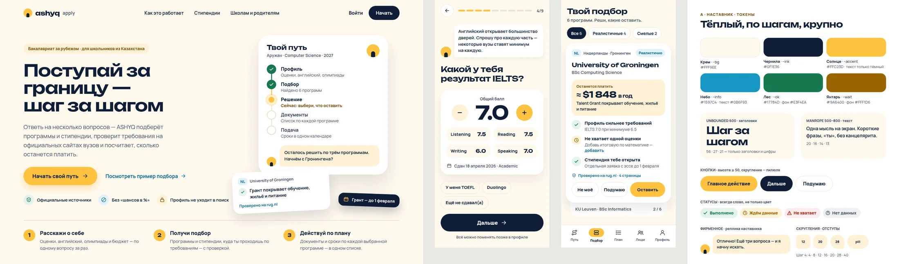

- **Idea.** A calm coach that asks one thing at a time and always says what is next. The shortlist is a
  stack of big cards, one programme at a time, decided with "Не моё / Подумаю / Оставить".
- **Type.** Unbounded 600 (headings and figures only) + Manrope 500–800.
- **Colour.** Cream `#FFF9EE`, ink `#0F1E36`, sun `#FFC23D` (dark text only), sky `#1597C4`
  (text `#0B6F93`), forest `#17784D`, amber `#9A6400`. Pill buttons ≥ 50 px, radii 12/20/28.
- **Signature.** The coach's speech bubble and the path rail (Профиль → Подбор → Решение → Документы → Подача).
- **Best for** the ordinary student on a phone; lowest cognitive load.
- **Risk.** Can read as childish to parents and counsellors, and gamification must never imply an outcome.

### B · Досье — serious, precise, sourced

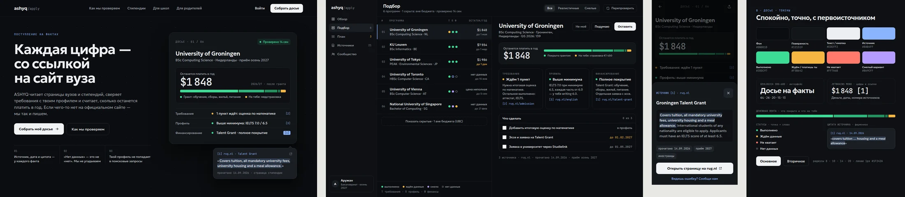

- **Idea.** A research dossier with the calm of a fintech app: the cost you will pay per year is the hero
  number, a ledger bar shows what the grant covers and what is on you, and every fact carries `[n]`
  that opens the quoted source. On desktop it is a list-plus-detail workspace.
- **Type.** Geologica 300–600 + JetBrains Mono for money, dates and citations.
- **Colour.** Graphite `#0B0D10`/`#121519`, text `#EDEFF2`, source blue `#8AB4FF`, done `#3DDC97`,
  waiting/you-pay `#F5B642`, gap `#FF7A6B`, ambitious `#B69CFF`. Hairlines `#1F242A`, radii 8–20.
- **Signature.** The cost ledger and the citation popover with the highlighted sentence.
- **Best for** trust, parents, school counsellors, the "unicorn" impression; strongest on desktop.
- **Risk.** Dark and dense; without discipline it re-creates today's overload in a nicer skin. Needs a
  light theme for daytime use and printing.

### C · Паспорт — a journey worth collecting

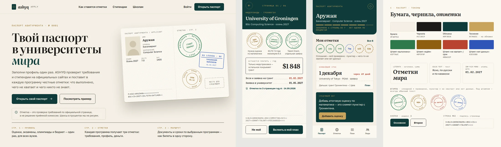

- **Idea.** The profile is a passport; each programme is a page that receives three stamps
  (requirements, profile, money). A solid stamp means checked, a dashed one means something is missing
  or unknown. The home screen shows the collected stamps and the next deadline as a ticket.
- **Type.** Literata (headings, sums) + Golos Text (UI) + IBM Plex Mono (stamps, dates, the MRZ line).
- **Colour.** Paper `#F4EFE4`, ink `#1C1B19`, cover `#0F3B3A` with gilt `#C9A45C`; stamp inks green
  `#2F7A4C`, ochre `#8F5F0F`, red `#B8432F`, blue `#2E55B8`.
- **Signature.** Rubber stamps and the passport's machine-readable line.
- **Best for** memorability and sharing; the most ownable brand of the four.
- **Risk.** A stamp looks like an approval. It must stay "requirement checked", never "admitted" — the
  landing carries that sentence explicitly, and every stamp has plain text underneath. Illustration
  work is heavier than in the other concepts.

### D · Ответ — ask in your own words

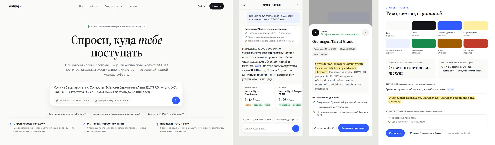

- **Idea.** The home page is one question box. The answer is prose in which every claim has a source
  chip; tapping it opens the official sentence under a highlighter, with the date and whom it applies
  to. Research progress is visible, and missing prices are said out loud.
- **Type.** Source Serif 4 (answers, headings) + Wix Madefor Display (UI).
- **Colour.** Paper white `#FBFBF9`, ink `#16161A`, cobalt `#2F5BFF`, highlighter `#FFEFA0`, done
  `#178A4C`, waiting `#A15C00`, gap `#C23A2B`. Radii 14/20/26 and pills.
- **Signature.** The source chip → highlighted quote.
- **Best for** the "2026 product" feel and the shortest path to value.
- **Risk.** The largest engineering change: free text has to become the structured profile, and the
  privacy table in `SPEC_matching_v2.md` §6.4 limits what may reach an LLM. Deadlines and documents still
  need structured screens, so D is a front door, not the whole app.

## 5. Round 1 recommendation (superseded by the owner's feedback)

Before the owner's feedback the recommendation was B's visual language with A's one-question profile.
The owner's feedback below replaced it.

## 6. Owner feedback on round 1 (2026-09-23)

- **A is the favourite, but not perfect yet.**
- **B:** the desktop shortlist workspace (list on the left, programme on the right) is good.
- **C:** the passport idea is fun, but the owner is not sure about it.
- **D:** the chat idea is fun, but people may take the product for a "GPT wrapper" and underrate it.
  The minimalist look is liked.
- Also: the canvas does not open on the owner's phone. Previews are sent as images in the chat, and
  every future round is delivered that way too.

## 7. Round 2 — three evolutions of A

Every round-2 concept keeps A's flow: one question per screen, a big card per programme, and
"Не моё / Подумаю / Оставить". Every one takes B's list-plus-detail workspace for the desktop shortlist.
None uses chat as the front door. They differ in how far they move A towards "serious".

### E · Ясно — A + D's minimalism

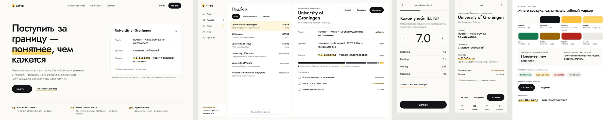

- **Idea.** A with the noise removed. There is no mascot face; the coach is one line of text. A
  programme is three typographic lines (*Подать / Профиль / Платить*), and the key figure carries a
  yellow highlighter, taken from A's sun and D's marker.
- **Type.** Jost 400–500 for headings and figures, Manrope 500–800 for text.
- **Colour.** Paper `#FBFAF6`, ink `#121417` (primary buttons), sun `#FFC23D`, marker `#FFD567`,
  hairlines `#ECEAE3`. Statuses as in A.
- **Risk.** It is the calmest of the three and the least memorable. The brand has to come from
  copy and the marker.

### F · Графит — A + B's seriousness

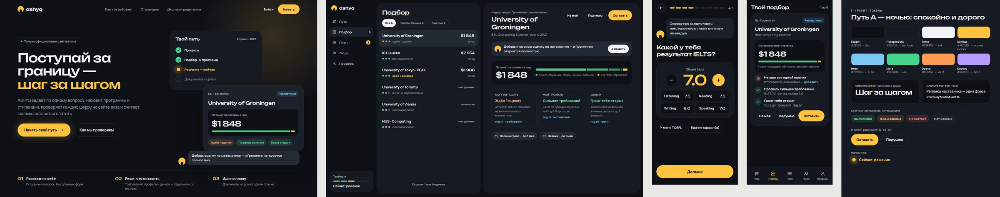

- **Idea.** A at night. It keeps A's type, rounded cards, path rail and coach, on graphite. The sun
  becomes the only bright colour: the primary button and "now". B's cost ledger is kept.
- **Type.** Unbounded 500 + Manrope.
- **Colour.** Graphite `#0E1116` / `#161A21`, text `#F2F3F5`, sun `#FFC23D`, sky link `#7CC7F5`,
  mint `#45D48A`, orange wait `#FF9A52`, lilac ambitious `#B69CFF`.
- **Risk.** A dark default is unusual for a school audience and for printing. It needs a light twin,
  which could simply be E.

### G · Ашық — A + an identity of its own

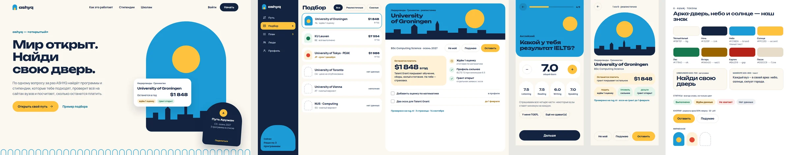

- **Idea.** Instead of C's passport, a simpler owned symbol: **the arch-door**, because *ashyq* means
  "open". Every university sits in its own arch with sky, sun and a flat city skyline. Profile score
  cards and status tiles repeat the arch. A shareable arch card, "Путь Аружан", replaces the passport as
  the social object.
- **Type.** Unbounded 600–700 + Manrope.
- **Colour.** Warm white `#FBF7EF`, night `#13233F`, sky `#1C9BD6` (dark text only), sun `#FFC23D`.
  Statuses as in A.
- **Risk.** It is the loudest of the three and needs illustration discipline: flat shapes only, no
  landmark clichés. The sky-and-sun palette echoes the national flag, which is a plus for a Kazakh
  audience but must stay a nod, not a flag.

## 8. Owner feedback on round 2 (2026-09-23)

- **G** looks far too unserious.
- **E** is like A, but A's landing page and A's fonts (Unbounded + Manrope) were more interesting.
- **F:** the owner is undecided.
- New concepts were requested, and new references were welcome.

## 9. Round 3 — serious, on A's typography

All three keep what was liked: Unbounded + Manrope, A's navy `#0F1E36` and sun `#FFC23D`, and a landing
page with a product scene rather than plain text. They drop the "toy" signals (big yellow blocks,
rotations, heavy shadows) and borrow structure from serious products instead of illustration.

New references for this round:

| Reference | What it lends | Used in |
|---|---|---|
| [Flighty iOS — flight alerts](https://mobbin.com/explore/screens/0b1b9d14-b576-44ea-b93b-c40ba046fbfd), [flights home](https://mobbin.com/explore/screens/f28cca69-a528-4c55-9170-5be260ef981a) | Map on top with a list sheet below; big origin → destination type; calm status words ("on time") | H |
| [21st.dev map components](https://21st.dev/community/components/s/map) — *World Map* (Manu Arora), *Globe Flights* (shuding), *Departures Board* (flightcn) | Dotted world map with arcs; flight-board precision | H |
| [Mercury web home](https://mobbin.com/explore/screens/d8564614-5b4c-4cdc-8088-0891fc9260df), [Stripe dashboard](https://mobbin.com/explore/screens/b6bcbb98-1398-4f4f-84ca-106dda66841e) | A calm, serious dashboard: greeting, quick actions, a bento of cards | I |
| [21st.dev bento grids](https://21st.dev/community/components/s/bento-grid) | A product-led hero built from real widgets | I |

### H · Маршруты — Flighty-like routes from Kazakhstan

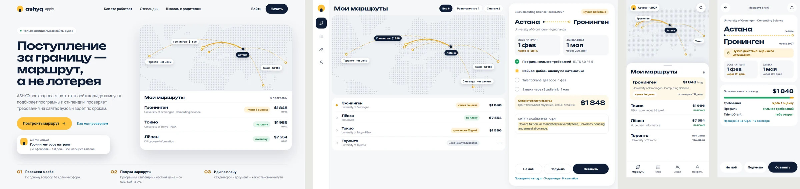

- **Idea.** Each programme is a route from Astana to a campus on a dotted world map. The phone home
  screen is a map with a sheet of routes. The programme screen reads like a flight: "Астана → Гронинген",
  the two key dates with days left, the path of steps, the money and the three judgements.
- **Why it is serious.** It borrows the precision of a travel tool (dates, days left, status words), and
  the map is drawn from real coordinates, not decoration.
- **Risk.** It is still a metaphor. It needs one careful rule: route status ("по плану", "нужно
  действие") describes the student's to-do list, never an admission outcome.

### I · Штаб — the whole application on one screen

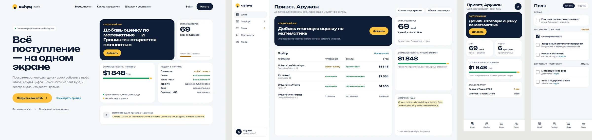

- **Idea.** A control room in the manner of Mercury and Stripe. The next step leads on a navy card,
  followed by the nearest deadline in days, the cost, the shortlist table and the source quote. The
  landing page is the same bento, so the product sells itself. On the phone, the home screen is a
  widget stack and "План" is grouped by deadline, using the fixture pages' own document lists.
- **Why it is serious.** It is the most "adult tool" of the three and the easiest for parents and
  counsellors to trust.
- **Risk.** It is less emotional. The hook must come from the next-step card and the money figure.

### J · Наставник 2.0 — A, finished

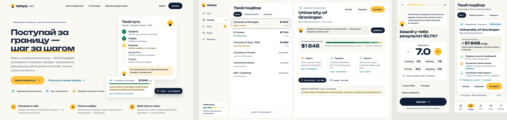

- **Idea.** A's landing page and fonts almost unchanged, because they were liked, with the playful
  signals removed:
  - thin borders instead of heavy shadows
  - no rotated cards
  - a neutral money block
  - a sun underline on "шаг за шагом"
  - a proof card with the grant's real quote and ledger
  - B's list-plus-detail workspace on desktop, with the coach line on top
- **Why it is serious.** It keeps everything the owner already approved and changes only what read as
  childish.
- **Risk.** It is close to A, so it will not surprise, but it is the safest path to "A, but serious".

## 10. Owner feedback on round 3 (2026-09-23)

- **H** was liked most.
- The owner asked for new concepts built on H, with new references welcome, and asked for an adversarial
  review to improve the result.

## 11. Round 4 — three ways to develop H, with an adversarial review

All three keep H's direction: the route from Kazakhstan, a dotted map drawn from real coordinates,
calm status words and the same three judgements. They also keep A's fonts. Each concept pushes
one part of H further.

New references for this round:

| Reference | What it lends | Used in |
|---|---|---|
| [Airbnb web — search results with a map](https://mobbin.com/explore/screens/c5b023cb-fab3-4ac0-8967-8b1cb34875a6), [Airbnb iOS — room details](https://mobbin.com/explore/screens/2d4d5075-5bca-4a65-be8b-b16d527aa3b7) | A search bar with three fields, a list beside the map, a price on every pin, a listing page with a sticky price bar | K |
| [21st.dev map components](https://21st.dev/community/components/s/map), including *Departures Board* | The precision of a flight board: fixed columns, split-flap figures, one status word per row | L |
| [Citymapper iOS — route map](https://mobbin.com/explore/screens/bfe8a3ec-fe61-42ff-9028-93d1dd30a55a), [route planner](https://mobbin.com/screens/8a78ff89-c1b0-4e01-9497-0f32444e06cc) | A route as a vertical line of stops, where the current stop is highlighted and the times sit on the right | M |
| [21st.dev map components](https://21st.dev/community/components/s/map), including *Globe Flights*; [21st.dev timelines](https://21st.dev/community/components/s/timeline) | A dotted globe with great-circle arcs; a stepped timeline | M |

### K · Атлас — search on the map, price after the grant on every point

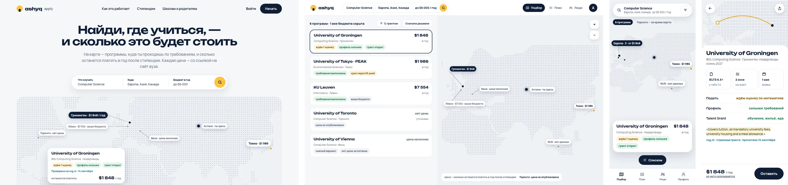

- **Idea.** Airbnb's pattern, applied to universities. The landing is one question, "Найди, где
  учиться, — и сколько это будет стоить", with a three-field search (what to study, where, budget
  per year) and H's map below. Every point carries a label: "Гронинген · $1 848 / год",
  "Лёвен · $7 554 · выше бюджета", "Торонто · нет цены". The desktop workspace is a list beside
  the map. On the phone, the map is the home screen and the programme page ends with a sticky price
  bar.
- **Who it serves best.** Parents: the money figure comes first and is never hidden.
- **Risk.** It is the closest to a marketplace. What sets it apart (the price after the grant, the
  three judgements and the source on each card) must stay on every point and every card.
  Otherwise it becomes "another catalogue".

### L · Табло — every deadline on one board, with what to do for each

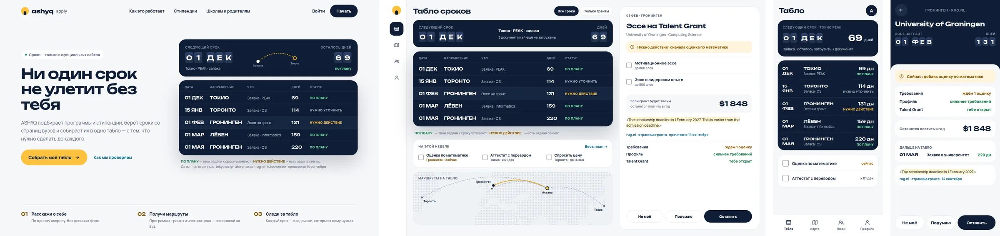

- **Idea.** A departures board for applications. Each row shows the date, the destination, what is
  due, the days left and one status word:
  - **ПО ПЛАНУ** — the student's tasks for that date are on track
  - **НУЖНО ДЕЙСТВИЕ** — there is a task to do now
  - **НУЖНО УТОЧНИТЬ** — something must be checked with the university

  The next deadline is a split-flap card. Below the board sit "На этой неделе" (this week's tasks)
  and a map strip of the same routes, so H's map is kept. Selecting a row opens its tasks, money,
  quote and the three judgements.
- **Who it serves best.** Students and school counsellors. It answers "what is due next and what do I
  do about it" at a glance.
- **Risk.** Countdowns can make a 16-year-old anxious. Money sits second on the landing page. The
  status words describe the student's tasks and never an admission outcome.

### M · Глобус — the route to a university, step by step

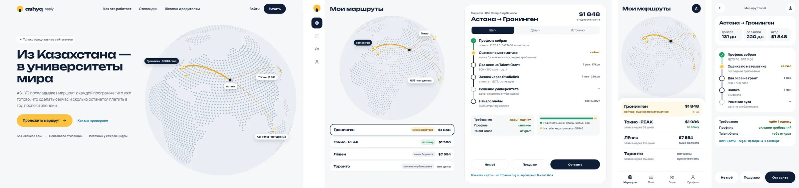

- **Idea.** H's routes on a dotted globe centred on Kazakhstan, with Citymapper's route screen for
  each programme:
  - done
  - now (highlighted)
  - next, with dates
  - unknown ("дата не опубликована")

  Below the steps come the three judgements and the source line. On desktop there is a globe with
  the route list on the left, and the journey, the money split and the actions on the right.
- **Who it serves best.** The first impression: it has the most emotion of the three and still shows
  the real numbers.
- **Risk.**
  - A dotted globe is a common SaaS hero, so it can look borrowed.
  - Routes on the far side (Toronto) cannot be seen without rotating the globe, so the list must be
    the source of truth.
  - A live globe must stay light on low-end Android. The fallback is the static SVG used here.

### Adversarial review (loop report)

**Definition of done, written before building:**

- 3 concepts × 4 boards (landing, desktop workspace, two phone screens)
- only numbers that exist in the demo corpus and fixture pages
- no "probability", "chance" or "%" next to a result; unknowns shown as "нет данных", "нет цены" or
  "цена неполная"; a source and date near every fact
- no clipped text, overlaps or mid-word wraps
- text contrast of at least 4.5:1; phone targets of at least 44 px
- A's fonts with H's palette
- at least two review cycles with hostile personas, the weakest link fixed and the remaining risks
  written down

**Personas:**

- a 16-year-old student
- a parent
- a school counsellor
- a designer at the level of Linear or Airbnb
- an auditor of the product's invariants and of accessibility
- a sceptical competitor

**Cycle 1** found 11 defects. Scores (mean of the six personas): K 6.3 · L 6.0 · M 7.0.

| # | Defect | Root cause | Fix |
|---|---|---|---|
| K1 | The European labels overlapped | Labels were anchored on the points, and three cities sit within 60 px at world scale | Labels moved into free space with leader lines; a cluster chip "Европа · 3 · от $1 848" on the phone |
| K2 | The selected card covered Toronto | The card was placed by the page layout, not by the map's geography | Moved over the ocean, below all the points |
| K3 | The over-budget price was struck through and read as a discount | An e-commerce convention was reused | Plain text "выше бюджета" |
| K4 | Tokyo was clipped on the phone | The label was centred on a point near the edge | Labels anchored on the side away from the edge |
| L1 | The board's columns overflowed | The only flexible column was squeezed by fixed ones | Explicit column widths |
| L2 | The split-flap effect was invisible | The tiles were too low in contrast and narrower than the glyphs | Wider tiles with a visible split line |
| L3 | "ЦЕНА НЕ ОПУБЛИКОВАНА" appeared in the deadline status column | Two axes (the deadline and the money) were mixed in one column | The deadline status reads "НУЖНО УТОЧНИТЬ"; the unknown price stays in the money judgement |
| L4 | L had lost H's map and had dead zones | The concept had been built as a table only | A mini route on the next-deadline card, a map strip, "На этой неделе" and a three-step band |
| M1 | The headline broke with a lone dash | Automatic wrapping of a long line with a dash | An explicit line break after "—" |
| M2 | The arcs were small and Europe sat on the rim | The globe was centred too far east | Rotated to 60° E, 36° N, made larger, with a thicker selected arc |
| M3 | The phone route had no source, no date and no judgements | Citymapper's pattern was copied without the product's invariants | The three judgements and "rug.nl · проверено 14 сентября" added |

**Cycle 2** re-rendered all 12 boards and found these defects:

- In K's workspace, the Лёвен and Вена labels collided.
- Astana had no label in K's workspace, and on K's landing its label was not styled like the others.
- On K's landing, the card's third status label ran past the card's edge.
- In K's list, "нет цены" and "неполная" were set in the bold figure style used for real prices, so
  they read as values. They are now muted text: "нет цены", "цена неполная".
- On L's landing:
  - the legend ran off the right edge and broke "u-tokyo.ac.jp" at its hyphen
  - the mini route's city names were clipped
  - the amber step numbers had a contrast of 3.4:1 (now 5.4:1)
- In M's phone route, "220 дн" wrapped inside its tile.
- Toronto was missing from M's route lists. It is now a row with "нет цены" and "нужно уточнить".

After cycle 2:

- no text below 11 px
- every text colour pair measured at 4.6:1 or more
- a scan of the 12 boards finds no "вероятн…", "шанс…" or percentage next to a result; the only
  match is the landing's promise "Без «шансов в %»"

Scores after cycle 2:

| Persona | K | L | M |
|---|---|---|---|
| Student, 16 | 8 | 8 | 8 |
| Parent | 8 | 6 | 7 |
| School counsellor | 7 | 8 | 7 |
| Designer | 7 | 8 | 8 |
| Invariants and accessibility auditor | 8 | 8 | 7 |
| Sceptical competitor | 6 | 6 | 6 |
| **Mean** | **7.3** | **7.3** | **7.2** |

**Remaining risks:**

- No concept wins outright; each wins with a different persona. The sceptic scores all three at 6,
  because each borrows a well-known pattern (Airbnb, a flight board, a globe).
- These are static mock-ups, not yet tested with real students.
- Contrast was measured from the token values, not with an automated tool on rendered pages.
- The map labels were placed by hand. Production needs collision-aware placement.

## 12. Next step

The owner picks K, L or M, or a mix. The review suggests a mix, because each concept wins with a
different persona:

- **M's globe** as the landing hero (the first impression)
- **K's search and map** as the "Подбор" tab (the money for parents)
- **L's board** as the "План" tab (deadlines for students and counsellors)
- the programme screen as M's step route plus K's sticky price bar

After the choice:

1. The next canvas round: the chosen direction across the real flow (landing, sign-in, profile
   questions, research progress, shortlist, programme, plan, documents), light and dark, 390 and 1440,
   delivered as phone images in the chat.
2. Tokens in `frontend/src/styles/tokens.css` (primitives → semantic → component), with the status
   vocabulary above in `i18n.ts`.
3. Apply screen by screen behind the existing tests, starting with the shortlist, which is where the
   overload is worst.
