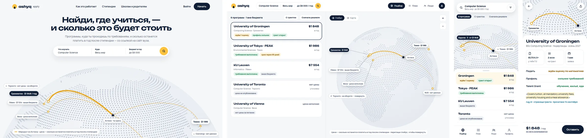
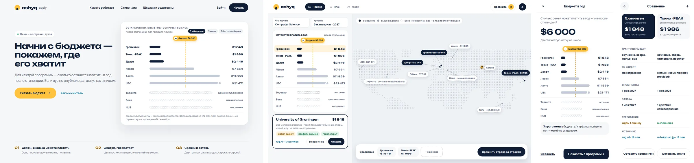
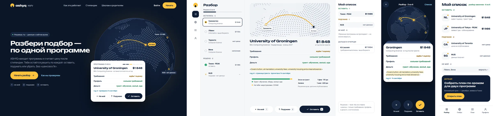
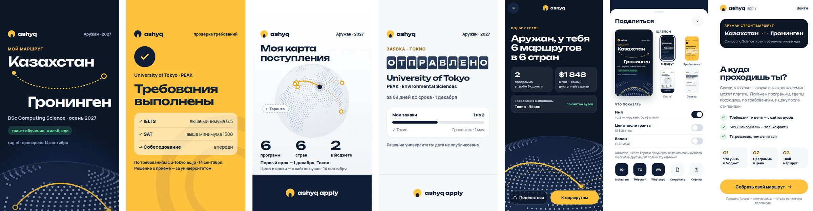
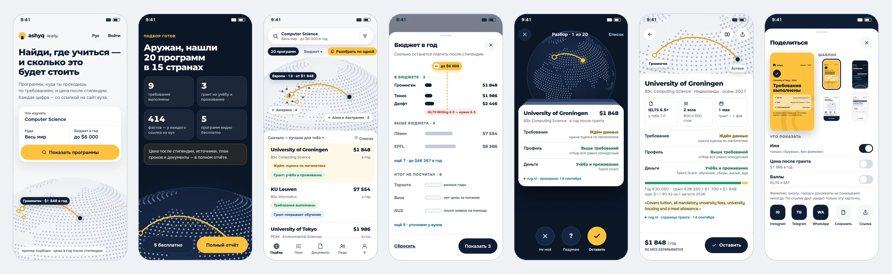
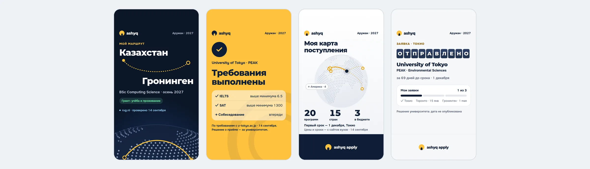
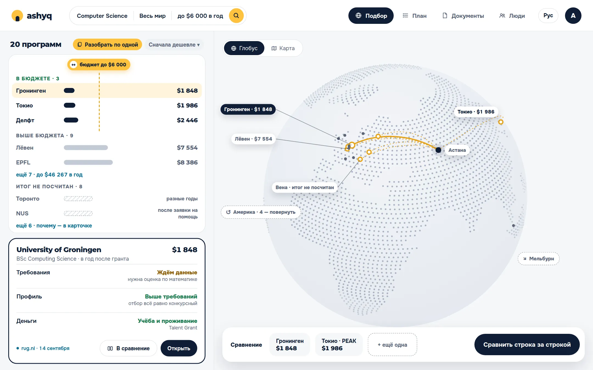
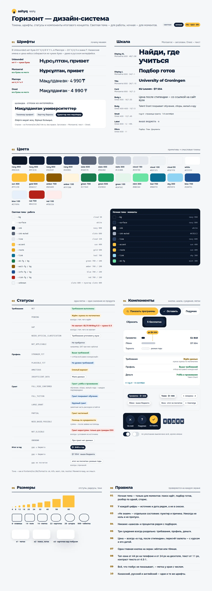
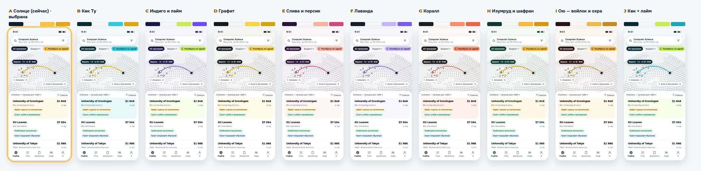

# Redesign concepts — rounds 1 to 7 (2026-09-23)

The owner asked for a redesign at the level of the product itself: the current UI is "not serious enough",
overloads an ordinary school student with information, and does not hook. The agreed process is
**concepts first, then develop the chosen one into a design system and apply it**. This file is the
record of the rounds: what is wrong today, what every concept keeps, the references, the four
round-1 directions, the owner's feedback, the round-2 and round-3 directions built from it, and the
round-4 developments of H, the round-5 directions on K and M, the round-6 share kit, and the round-7 final concept
«Горизонт» with its design system, each with its adversarial review.

- Live canvas with all 96 artboards (private to the owner until shared):
  https://claude.ai/artifact/Ncsd2YkQMcV9oCG3bHrBsa
- Nothing in `frontend/` changes in this round. PR #10 (tokenised profile workflow) and PR #19
  ("Open Path" visual refinement) are untouched; whichever concept wins decides what happens to them.

## 1. What is wrong today (main and PR #19)

Seen on `main` screenshots and the PR #19 branch screenshots (`docs/screenshots/*`).

| Problem | Where | Why it hurts a 16-year-old |
|---|---|---|
| The shortlist is a 10-column spreadsheet: eligibility, fit, funding, remaining/year, deadline, match `0.82`, confirmed `94%`, bucket, decision | Step 04 | Nine judgements per row, none of them the answer to "can I go there and can I afford it?". Chips wrap mid-word (`Pendi ng`, `Strong er`, `Plausi ble`) |
| Engineering vocabulary on screen | everywhere | "Match, discounted by what is unverified", "Filled to quota before the ranking speaks", `fixture://` |
| A 16-item sidebar with numbered steps 01–09 plus a community block | shell | Eight gated items the student cannot open yet |
| The profile is one 4 000–5 000 px form in four-column grids | Step 01 | Everything asked at once; nothing celebrates progress |
| Legal-grade caveats as the first thing on every screen | headers, banners | The trust promise reads as a disclaimer instead of a feature |
| Mixed Russian and English in navigation and account copy | shell, PR #19 | Noted in PR #19 itself as unfinished |
| `94%` "confirmed" in the ranked table | Step 04 | AGENTS.md §6 rules out `%` next to the ranking; the concepts say "3 источника" instead |
| The evidence — the product's real advantage — is buried in a sixth tab | row detail | The one thing competitors do not have is the hardest thing to find |

PR #19 made the look calmer, but the structure above is the same, so the overload remains.

## 2. What every concept keeps

These are the UX decisions; the four concepts differ only in look, tone and interaction model.

1. **One answer first, evidence on demand.** Each programme leads with the three things a student asks:
   *Can I apply? Where does my profile sit? What will it cost me per year?* Everything else is one tap down.
2. **Three judgements stay three.** Requirements, profile and money are always shown separately and never
   merged into a score (I-invariants, AGENTS.md §6). No `%`, no "chance", no single verdict.
3. **"No data" is a visible state, not an empty cell.** Every concept draws it (`нет данных`,
   `цена неполная`) and says "we will not guess".
4. **The source is the signature, not a footnote.** Each concept has one memorable way to show *where a
   fact was read, when, and the exact quote* — the coach's "checked on rug.nl", the dossier's `[1]`
   citation, the passport stamp, the highlighter marker.
5. **Five navigation items at most** (path/overview, shortlist, plan, community, profile). Research
   progress, sources and export stop being top-level destinations.
6. **The profile is asked, not filled.** One question per screen (A), one conversation (D), or pages of a
   passport (C) — never a 5 000 px form.
7. **Plain Russian, "ты", no jargon.** Kazakh next; English only for programme names.
8. **Accessible as drawn**: ≥ 44 px touch targets on phones, 4.5:1 text contrast, status is always a word as well as a
   colour.

### Status vocabulary (domain enum → what the student reads)

This mapping is concept-independent and can go into `i18n.ts` whichever direction wins.

| Domain value | Russian label |
|---|---|
| `EligibilityStatus.MET` | Выполнено |
| `EligibilityStatus.PENDING` | Ждём данные (+ what exactly: «нужна оценка по математике») |
| `EligibilityStatus.GAP` | Не хватает |
| `EligibilityStatus.NEEDS_OFFICIAL_CLARIFICATION` | Уточняем у вуза |
| `AdmissionsFit.STRONGER_FIT` | Выше требований |
| `AdmissionsFit.PLAUSIBLE_FIT` | На уровне требований |
| `AdmissionsFit.AMBITIOUS` | Смелый вариант |
| `AdmissionsFit.INSUFFICIENT_DATA` | Мало данных |
| `FundingFit.CONFIRMED_OPPORTUNITY` | Стипендия тебе открыта |
| `FundingFit.NOT_ELIGIBLE` | Не для тебя |
| `FundingFit.UNKNOWN` | Нет данных |
| `Bucket.PLAUSIBLE` / `AMBITIOUS` / `OUT_OF_BUDGET` | Реалистично / Смело / Вне бюджета (скрыто, но доступно) |

## 3. References

Mobbin was read through its public flow and screen pages; 21st.dev through its component directory.

| Reference | What it lends | Used in |
|---|---|---|
| [Duolingo iOS onboarding](https://mobbin.com/explore/flows/0acc27c7-4e01-481c-83b2-99f8d741bef1) | One question per screen, value before sign-up, a character who talks | A |
| [Revolut iOS onboarding](https://mobbin.com/explore/flows/633b424d-a942-466c-a0ac-32d67d15033c) | One bold statement per screen, product shown inside the pitch | A, B |
| [Wise iOS account home](https://mobbin.com/explore/screens/b56addbb-a616-490b-8dda-41ff42b8c310) | Money as one large, calm number with activity underneath | B (cost ledger) |
| [Perplexity web answer](https://mobbin.com/explore/screens/29a9bc09-1bcf-4913-9432-0e47ddb3fc2b) | Answer prose with numbered sources; "reviewed N sources" trace | B, D |
| [Airbnb iOS listing detail](https://mobbin.com/explore/flows/acabe8c6-b01c-4787-aa8c-d056dd6d5bef) | A place as a card you want to open; price and dates as the anchor | C |
| [Khan Academy Android onboarding](https://mobbin.com/explore/flows/d28e13b4-fe4c-4091-9e5c-edaf3ca02d80) | Education onboarding that goes straight into the core task | A |
| [21st.dev AI chat components](https://21st.dev/community/components/s/ai-chat) — *AI Task List*, *Agent Activity*, *Prompt Input with Actions*, *Suggestions* | Visible research progress, composer with attachments and suggestion chips | D |
| [21st.dev timeline components](https://21st.dev/community/components/s/timeline) — *Onboarding Timeline*, *Order tracking*, *Processing Timeline* | The path/milestone rail | A |
| [21st.dev hero directory](https://21st.dev/community/components/s/hero) | Hero anatomy: one offer, one action, proof beside it | all landings |

No third-party screen is reproduced; the references informed patterns only.

## 4. The four concepts

All data on the artboards is the repository's own demo corpus (`backend/app/corpus/`): Groningen
BSc Computing Science with the Talent Grant, KU Leuven, Tokyo PEAK, Toronto, Vienna, NUS; the demo
applicant's IELTS 7.0 (writing 6.0), SAT 1400, GPA 4.8/5. The quoted grant sentence is the fixture page's
own text. Where the corpus has no complete price (Vienna, NUS, Toronto) the artboards say so.

### A · Наставник — step by step, warm, big

- **Idea.** A calm coach that asks one thing at a time and always says what is next. The shortlist is a
  stack of big cards, one programme at a time, decided with "Не моё / Подумаю / Оставить".
- **Type.** Unbounded 600 (headings and figures only) + Manrope 500–800.
- **Colour.** Cream `#FFF9EE`, ink `#0F1E36`, sun `#FFC23D` (dark text only), sky `#1597C4`
  (text `#0B6F93`), forest `#17784D`, amber `#9A6400`. Pill buttons ≥ 50 px, radii 12/20/28.
- **Signature.** The coach's speech bubble and the path rail (Профиль → Подбор → Решение → Документы → Подача).
- **Best for** the ordinary student on a phone; lowest cognitive load.
- **Risk.** Can read as childish to parents and counsellors, and gamification must never imply an outcome.

### B · Досье — serious, precise, sourced

- **Idea.** A research dossier with the calm of a fintech app: the cost you will pay per year is the hero
  number, a ledger bar shows what the grant covers and what is on you, and every fact carries `[n]`
  that opens the quoted source. On desktop it is a list-plus-detail workspace.
- **Type.** Geologica 300–600 + JetBrains Mono for money, dates and citations.
- **Colour.** Graphite `#0B0D10`/`#121519`, text `#EDEFF2`, source blue `#8AB4FF`, done `#3DDC97`,
  waiting/you-pay `#F5B642`, gap `#FF7A6B`, ambitious `#B69CFF`. Hairlines `#1F242A`, radii 8–20.
- **Signature.** The cost ledger and the citation popover with the highlighted sentence.
- **Best for** trust, parents, school counsellors, the "unicorn" impression; strongest on desktop.
- **Risk.** Dark and dense; without discipline it re-creates today's overload in a nicer skin. Needs a
  light theme for daytime use and printing.

### C · Паспорт — a journey worth collecting

- **Idea.** The profile is a passport; each programme is a page that receives three stamps
  (requirements, profile, money). A solid stamp means checked, a dashed one means something is missing
  or unknown. The home screen shows the collected stamps and the next deadline as a ticket.
- **Type.** Literata (headings, sums) + Golos Text (UI) + IBM Plex Mono (stamps, dates, the MRZ line).
- **Colour.** Paper `#F4EFE4`, ink `#1C1B19`, cover `#0F3B3A` with gilt `#C9A45C`; stamp inks green
  `#2F7A4C`, ochre `#8F5F0F`, red `#B8432F`, blue `#2E55B8`.
- **Signature.** Rubber stamps and the passport's machine-readable line.
- **Best for** memorability and sharing; the most ownable brand of the four.
- **Risk.** A stamp looks like an approval. It must stay "requirement checked", never "admitted" — the
  landing carries that sentence explicitly, and every stamp has plain text underneath. Illustration
  work is heavier than in the other concepts.

### D · Ответ — ask in your own words

- **Idea.** The home page is one question box. The answer is prose in which every claim has a source
  chip; tapping it opens the official sentence under a highlighter, with the date and whom it applies
  to. Research progress is visible, and missing prices are said out loud.
- **Type.** Source Serif 4 (answers, headings) + Wix Madefor Display (UI).
- **Colour.** Paper white `#FBFBF9`, ink `#16161A`, cobalt `#2F5BFF`, highlighter `#FFEFA0`, done
  `#178A4C`, waiting `#A15C00`, gap `#C23A2B`. Radii 14/20/26 and pills.
- **Signature.** The source chip → highlighted quote.
- **Best for** the "2026 product" feel and the shortest path to value.
- **Risk.** The largest engineering change: free text has to become the structured profile, and the
  privacy table in `SPEC_matching_v2.md` §6.4 limits what may reach an LLM. Deadlines and documents still
  need structured screens, so D is a front door, not the whole app.

## 5. Round 1 recommendation (superseded by the owner's feedback)

Before the owner's feedback the recommendation was B's visual language with A's one-question profile.
The owner's feedback below replaced it.

## 6. Owner feedback on round 1 (2026-09-23)

- **A is the favourite, but not perfect yet.**
- **B:** the desktop shortlist workspace (list on the left, programme on the right) is good.
- **C:** the passport idea is fun, but the owner is not sure about it.
- **D:** the chat idea is fun, but people may take the product for a "GPT wrapper" and underrate it.
  The minimalist look is liked.
- Also: the canvas does not open on the owner's phone. Previews are sent as images in the chat, and
  every future round is delivered that way too.

## 7. Round 2 — three evolutions of A

Every round-2 concept keeps A's flow: one question per screen, a big card per programme, and
"Не моё / Подумаю / Оставить". Every one takes B's list-plus-detail workspace for the desktop shortlist.
None uses chat as the front door. They differ in how far they move A towards "serious".

### E · Ясно — A + D's minimalism

- **Idea.** A with the noise removed. There is no mascot face; the coach is one line of text. A
  programme is three typographic lines (*Подать / Профиль / Платить*), and the key figure carries a
  yellow highlighter, taken from A's sun and D's marker.
- **Type.** Jost 400–500 for headings and figures, Manrope 500–800 for text.
- **Colour.** Paper `#FBFAF6`, ink `#121417` (primary buttons), sun `#FFC23D`, marker `#FFD567`,
  hairlines `#ECEAE3`. Statuses as in A.
- **Risk.** It is the calmest of the three and the least memorable. The brand has to come from
  copy and the marker.

### F · Графит — A + B's seriousness

- **Idea.** A at night. It keeps A's type, rounded cards, path rail and coach, on graphite. The sun
  becomes the only bright colour: the primary button and "now". B's cost ledger is kept.
- **Type.** Unbounded 500 + Manrope.
- **Colour.** Graphite `#0E1116` / `#161A21`, text `#F2F3F5`, sun `#FFC23D`, sky link `#7CC7F5`,
  mint `#45D48A`, orange wait `#FF9A52`, lilac ambitious `#B69CFF`.
- **Risk.** A dark default is unusual for a school audience and for printing. It needs a light twin,
  which could simply be E.

### G · Ашық — A + an identity of its own

- **Idea.** Instead of C's passport, a simpler owned symbol: **the arch-door**, because *ashyq* means
  "open". Every university sits in its own arch with sky, sun and a flat city skyline. Profile score
  cards and status tiles repeat the arch. A shareable arch card, "Путь Аружан", replaces the passport as
  the social object.
- **Type.** Unbounded 600–700 + Manrope.
- **Colour.** Warm white `#FBF7EF`, night `#13233F`, sky `#1C9BD6` (dark text only), sun `#FFC23D`.
  Statuses as in A.
- **Risk.** It is the loudest of the three and needs illustration discipline: flat shapes only, no
  landmark clichés. The sky-and-sun palette echoes the national flag, which is a plus for a Kazakh
  audience but must stay a nod, not a flag.

## 8. Owner feedback on round 2 (2026-09-23)

- **G** looks far too unserious.
- **E** is like A, but A's landing page and A's fonts (Unbounded + Manrope) were more interesting.
- **F:** the owner is undecided.
- New concepts were requested, and new references were welcome.

## 9. Round 3 — serious, on A's typography

All three keep what was liked: Unbounded + Manrope, A's navy `#0F1E36` and sun `#FFC23D`, and a landing
page with a product scene rather than plain text. They drop the "toy" signals (big yellow blocks,
rotations, heavy shadows) and borrow structure from serious products instead of illustration.

New references for this round:

| Reference | What it lends | Used in |
|---|---|---|
| [Flighty iOS — flight alerts](https://mobbin.com/explore/screens/0b1b9d14-b576-44ea-b93b-c40ba046fbfd), [flights home](https://mobbin.com/explore/screens/f28cca69-a528-4c55-9170-5be260ef981a) | Map on top with a list sheet below; big origin → destination type; calm status words ("on time") | H |
| [21st.dev map components](https://21st.dev/community/components/s/map) — *World Map* (Manu Arora), *Globe Flights* (shuding), *Departures Board* (flightcn) | Dotted world map with arcs; flight-board precision | H |
| [Mercury web home](https://mobbin.com/explore/screens/d8564614-5b4c-4cdc-8088-0891fc9260df), [Stripe dashboard](https://mobbin.com/explore/screens/b6bcbb98-1398-4f4f-84ca-106dda66841e) | A calm, serious dashboard: greeting, quick actions, a bento of cards | I |
| [21st.dev bento grids](https://21st.dev/community/components/s/bento-grid) | A product-led hero built from real widgets | I |

### H · Маршруты — Flighty-like routes from Kazakhstan

- **Idea.** Each programme is a route from Astana to a campus on a dotted world map. The phone home
  screen is a map with a sheet of routes. The programme screen reads like a flight: "Астана → Гронинген",
  the two key dates with days left, the path of steps, the money and the three judgements.
- **Why it is serious.** It borrows the precision of a travel tool (dates, days left, status words), and
  the map is drawn from real coordinates, not decoration.
- **Risk.** It is still a metaphor. It needs one careful rule: route status ("по плану", "нужно
  действие") describes the student's to-do list, never an admission outcome.

### I · Штаб — the whole application on one screen

- **Idea.** A control room in the manner of Mercury and Stripe. The next step leads on a navy card,
  followed by the nearest deadline in days, the cost, the shortlist table and the source quote. The
  landing page is the same bento, so the product sells itself. On the phone, the home screen is a
  widget stack and "План" is grouped by deadline, using the fixture pages' own document lists.
- **Why it is serious.** It is the most "adult tool" of the three and the easiest for parents and
  counsellors to trust.
- **Risk.** It is less emotional. The hook must come from the next-step card and the money figure.

### J · Наставник 2.0 — A, finished

- **Idea.** A's landing page and fonts almost unchanged, because they were liked, with the playful
  signals removed:
  - thin borders instead of heavy shadows
  - no rotated cards
  - a neutral money block
  - a sun underline on "шаг за шагом"
  - a proof card with the grant's real quote and ledger
  - B's list-plus-detail workspace on desktop, with the coach line on top
- **Why it is serious.** It keeps everything the owner already approved and changes only what read as
  childish.
- **Risk.** It is close to A, so it will not surprise, but it is the safest path to "A, but serious".

## 10. Owner feedback on round 3 (2026-09-23)

- **H** was liked most.
- The owner asked for new concepts built on H, with new references welcome, and asked for an adversarial
  review to improve the result.

## 11. Round 4 — three ways to develop H, with an adversarial review

All three keep H's direction: the route from Kazakhstan, a dotted map drawn from real coordinates,
calm status words and the same three judgements. They also keep A's fonts. Each concept pushes
one part of H further.

New references for this round:

| Reference | What it lends | Used in |
|---|---|---|
| [Airbnb web — search results with a map](https://mobbin.com/explore/screens/c5b023cb-fab3-4ac0-8967-8b1cb34875a6), [Airbnb iOS — room details](https://mobbin.com/explore/screens/2d4d5075-5bca-4a65-be8b-b16d527aa3b7) | A search bar with three fields, a list beside the map, a price on every pin, a listing page with a sticky price bar | K |
| [21st.dev map components](https://21st.dev/community/components/s/map), including *Departures Board* | The precision of a flight board: fixed columns, split-flap figures, one status word per row | L |
| [Citymapper iOS — route map](https://mobbin.com/explore/screens/bfe8a3ec-fe61-42ff-9028-93d1dd30a55a), [route planner](https://mobbin.com/screens/8a78ff89-c1b0-4e01-9497-0f32444e06cc) | A route as a vertical line of stops, where the current stop is highlighted and the times sit on the right | M |
| [21st.dev map components](https://21st.dev/community/components/s/map), including *Globe Flights*; [21st.dev timelines](https://21st.dev/community/components/s/timeline) | A dotted globe with great-circle arcs; a stepped timeline | M |

### K · Атлас — search on the map, price after the grant on every point

- **Idea.** Airbnb's pattern, applied to universities. The landing is one question, "Найди, где
  учиться, — и сколько это будет стоить", with a three-field search (what to study, where, budget
  per year) and H's map below. Every point carries a label: "Гронинген · $1 848 / год",
  "Лёвен · $7 554 · выше бюджета", "Торонто · нет цены". The desktop workspace is a list beside
  the map. On the phone, the map is the home screen and the programme page ends with a sticky price
  bar.
- **Who it serves best.** Parents: the money figure comes first and is never hidden.
- **Risk.** It is the closest to a marketplace. What sets it apart (the price after the grant, the
  three judgements and the source on each card) must stay on every point and every card.
  Otherwise it becomes "another catalogue".

### L · Табло — every deadline on one board, with what to do for each

- **Idea.** A departures board for applications. Each row shows the date, the destination, what is
  due, the days left and one status word:
  - **ПО ПЛАНУ** — the student's tasks for that date are on track
  - **НУЖНО ДЕЙСТВИЕ** — there is a task to do now
  - **НУЖНО УТОЧНИТЬ** — something must be checked with the university

  The next deadline is a split-flap card. Below the board sit "На этой неделе" (this week's tasks)
  and a map strip of the same routes, so H's map is kept. Selecting a row opens its tasks, money,
  quote and the three judgements.
- **Who it serves best.** Students and school counsellors. It answers "what is due next and what do I
  do about it" at a glance.
- **Risk.** Countdowns can make a 16-year-old anxious. Money sits second on the landing page. The
  status words describe the student's tasks and never an admission outcome.

### M · Глобус — the route to a university, step by step

- **Idea.** H's routes on a dotted globe centred on Kazakhstan, with Citymapper's route screen for
  each programme:
  - done
  - now (highlighted)
  - next, with dates
  - unknown ("дата не опубликована")

  Below the steps come the three judgements and the source line. On desktop there is a globe with
  the route list on the left, and the journey, the money split and the actions on the right.
- **Who it serves best.** The first impression: it has the most emotion of the three and still shows
  the real numbers.
- **Risk.**
  - A dotted globe is a common SaaS hero, so it can look borrowed.
  - Routes on the far side (Toronto) cannot be seen without rotating the globe, so the list must be
    the source of truth.
  - A live globe must stay light on low-end Android. The fallback is the static SVG used here.

### Adversarial review (loop report)

**Definition of done, written before building:**

- 3 concepts × 4 boards (landing, desktop workspace, two phone screens)
- only numbers that exist in the demo corpus and fixture pages
- no "probability", "chance" or "%" next to a result; unknowns shown as "нет данных", "нет цены" or
  "цена неполная"; a source and date near every fact
- no clipped text, overlaps or mid-word wraps
- text contrast of at least 4.5:1; phone targets of at least 44 px
- A's fonts with H's palette
- at least two review cycles with hostile personas, the weakest link fixed and the remaining risks
  written down

**Personas:**

- a 16-year-old student
- a parent
- a school counsellor
- a designer at the level of Linear or Airbnb
- an auditor of the product's invariants and of accessibility
- a sceptical competitor

**Cycle 1** found 11 defects. Scores (mean of the six personas): K 6.3 · L 6.0 · M 7.0.

| # | Defect | Root cause | Fix |
|---|---|---|---|
| K1 | The European labels overlapped | Labels were anchored on the points, and three cities sit within 60 px at world scale | Labels moved into free space with leader lines; a cluster chip "Европа · 3 · от $1 848" on the phone |
| K2 | The selected card covered Toronto | The card was placed by the page layout, not by the map's geography | Moved over the ocean, below all the points |
| K3 | The over-budget price was struck through and read as a discount | An e-commerce convention was reused | Plain text "выше бюджета" |
| K4 | Tokyo was clipped on the phone | The label was centred on a point near the edge | Labels anchored on the side away from the edge |
| L1 | The board's columns overflowed | The only flexible column was squeezed by fixed ones | Explicit column widths |
| L2 | The split-flap effect was invisible | The tiles were too low in contrast and narrower than the glyphs | Wider tiles with a visible split line |
| L3 | "ЦЕНА НЕ ОПУБЛИКОВАНА" appeared in the deadline status column | Two axes (the deadline and the money) were mixed in one column | The deadline status reads "НУЖНО УТОЧНИТЬ"; the unknown price stays in the money judgement |
| L4 | L had lost H's map and had dead zones | The concept had been built as a table only | A mini route on the next-deadline card, a map strip, "На этой неделе" and a three-step band |
| M1 | The headline broke with a lone dash | Automatic wrapping of a long line with a dash | An explicit line break after "—" |
| M2 | The arcs were small and Europe sat on the rim | The globe was centred too far east | Rotated to 60° E, 36° N, made larger, with a thicker selected arc |
| M3 | The phone route had no source, no date and no judgements | Citymapper's pattern was copied without the product's invariants | The three judgements and "rug.nl · проверено 14 сентября" added |

**Cycle 2** re-rendered all 12 boards and found these defects:

- In K's workspace, the Лёвен and Вена labels collided.
- Astana had no label in K's workspace, and on K's landing its label was not styled like the others.
- On K's landing, the card's third status label ran past the card's edge.
- In K's list, "нет цены" and "неполная" were set in the bold figure style used for real prices, so
  they read as values. They are now muted text: "нет цены", "цена неполная".
- On L's landing:
  - the legend ran off the right edge and broke "u-tokyo.ac.jp" at its hyphen
  - the mini route's city names were clipped
  - the amber step numbers had a contrast of 3.4:1 (now 5.4:1)
- In M's phone route, "220 дн" wrapped inside its tile.
- Toronto was missing from M's route lists. It is now a row with "нет цены" and "нужно уточнить".

After cycle 2:

- no text below 11 px
- every text colour pair measured at 4.6:1 or more
- a scan of the 12 boards finds no "вероятн…", "шанс…" or percentage next to a result; the only
  match is the landing's promise "Без «шансов в %»"

Scores after cycle 2:

| Persona | K | L | M |
|---|---|---|---|
| Student, 16 | 8 | 8 | 8 |
| Parent | 8 | 6 | 7 |
| School counsellor | 7 | 8 | 7 |
| Designer | 7 | 8 | 8 |
| Invariants and accessibility auditor | 8 | 8 | 7 |
| Sceptical competitor | 6 | 6 | 6 |
| **Mean** | **7.3** | **7.3** | **7.2** |

**Remaining risks:**

- No concept wins outright; each wins with a different persona. The sceptic scores all three at 6,
  because each borrows a well-known pattern (Airbnb, a flight board, a globe).
- These are static mock-ups, not yet tested with real students.
- Contrast was measured from the token values, not with an automated tool on rendered pages.
- The map labels were placed by hand. Production needs collision-aware placement.

## 12. Owner feedback on round 4 (2026-09-23)

- **K** and **M** were liked. K is the better of the two, but M's globe is appealing.
- The owner asked for something new again.

## 13. Round 5 — new directions on K, with M's globe

The owner's pick shapes this round: all three concepts keep K's core, which is the price after the
grant on every point and card, and put M's globe to work. One concept fuses K and M directly. The
other two try new ideas: one leads with money, the other with the decision on each programme.

New references for this round:

| Reference | What it lends | Used in |
|---|---|---|
| [21st.dev globe components](https://21st.dev/community/components/s/globe) — *Globe* (Dillion Verma), *COBE Globe*, *Globe Interactive* and *Globe Pulse* (shuding) | A globe rising from the bottom of the page like a horizon; labelled markers; a night globe | N, P |
| [Google Flights Explore](https://www.google.com/travel/explore) | Filters and a list on the left, a map with a price on every destination on the right | O |
| [Airbnb Android — filter with a price range](https://mobbin.com/explore/screens/8bc5e6ac-e18f-4ccf-8701-81b98ec58c0a) | Price as the main filter, drawn as a chart you drag | O |

### N · Горизонт — K, with the globe rising under the search

- **Idea.** K's landing page, with M's globe below the search, rising like a horizon.
  - The points on the globe carry K's price labels, and the arcs start in Astana.
  - A destination the globe hides gets a chip at the edge instead of an arc through empty space:
    "Торонто · нет цены · на обороте", "Сингапур ↓". This fixes the risk M left open in round 4.
  - The workspace is K's list, with a globe or a map to choose from.
  - On the phone, the globe sits at the top with a sheet of cards below it. The programme page is
    K's, with the route drawn on the globe.
- **Who it serves best.** It keeps what the owner already approved and adds the "wow" of M.
- **Risk.** Cities near the globe's rim are squeezed together, so labels need collision-aware
  placement and a rotate gesture in code. A live globe must stay light on low-end phones.

### O · Бюджет — the money first

- **Idea.** The first question is "how much can the family pay per year, after the scholarship?".
  The answer is a price ladder: one bar per programme, showing what is left to pay per year, and a
  yellow budget marker you drag across.
  - Programmes under the marker are dark; those above it are grey.
  - A programme without a full price gets a hatched bar with "нет цены", "цена неполная" or "нет
    данных", and no number is guessed.
  - The workspace follows Google Flights Explore: the ladder is the list on the left, the map with a
    price chip on every destination is on the right, and a comparison tray sits at the bottom.
  - On the phone there is a filter sheet like Airbnb's and a comparison line by line: what the grant
    covers, what it leaves out, the dates, the requirements and the sources.
- **Honest details from the corpus.**
  - TU Delft fits the budget, but its IELTS Writing minimum (6.5) is above the profile's 6.0.
  - Tokyo's MEXT grant page says "Housing is not provided".
  - UBC is cut off at $12 000 on the scale, and the scale says so.
- **Who it serves best.** Parents: the answer they need comes first.
- **Risk.** A money-first screen can make a student drop ambitious options too early, so "above
  budget" stays visible and is never hidden. The ladder works for a dozen programmes; with 30 or
  more it needs grouping.

### P · Разбор — decide on one programme at a time

- **Idea.** Once the shortlist is ready, the student goes through it one card at a time and picks
  one of three decisions: "Не моё", "Подумаю" or "Оставить".
  - On the phone this is a card stack over a night globe.
  - On desktop it is a triage queue in the manner of Linear, with keys 1, 2 and 3.
  - The result is "Мой список", grouped by decision, with the removed programmes one tap away and
    "Дальше: план" as the next step.
  - The landing page is dark, with a glowing globe (GitHub or Stripe style) and the Groningen card
    in front of it.
- **Who it serves best.** The 16-year-old: it has the most engagement of the three and turns a table
  into a series of small decisions.
- **Risk.**
  - Card swiping can read as a dating app. Decisions must stay reversible, and the copy stays calm.
  - A dark landing page next to a light app is two themes to maintain.
  - Parents may not like "decide card by card".

### Adversarial review (loop report)

The same Definition of Done and the same six personas as round 4 (§11). One rule was added from
round 4: every headline gets a no-break space before its dash.

**Cycle 1** found 14 defects. Scores (mean of the six personas): N 7.0 · O 6.3 · P 6.0.

| # | Defect | Root cause | Fix |
|---|---|---|---|
| N1 | Arcs to destinations behind the globe ran through empty space above the headline | Arc drawing dropped only the far-side points, not hidden destinations | A hidden destination gets an edge chip ("на обороте") and no arc |
| N2 | In the workspace, the Лёвен label and the Toronto chip were clipped at the pane's edge | Labels anchored on their right side near the left edge | Anchored on the left, in free space |
| N3 | On the programme page, the Groningen label was cut at the screen edge and "на грант · 1 фев" broke mid-phrase | The globe was framed on the arc's ends with no margin; too much text in a tile | A smaller globe radius; shorter tile text |
| O1 | Prices showed as "$1848" without a space | The narrow no-break space is missing from the Unbounded font | A regular no-break space |
| O2 | The headline broke with a lone dash | Automatic wrapping, the same cause as M1 in round 4 | A no-break space before the dash, now a rule |
| O3 | "цена не опубликована" ran out of the card in the workspace and on the phone | The value column was sized for prices | A wider column for unknowns; "нет цены" in narrow layouts |
| O4 | On the phone, the slider and the budget line disagreed | Two controls for one value, on different scales | The yellow marker on the ladder is the only control |
| O5 | In the workspace, the price histogram was ordered by programme, not by price, so a price slider under it misled | The Airbnb pattern was copied without its axis | The ladder itself became the list |
| O6 | The budget marker collided with the card heading | Not enough room above the ladder | More room above the ladder |
| P1 | The headline broke with a lone dash | As O2 | As O2 |
| P2 | Name and price ran together on the landing card ("Groningen$1 848") | No gap in the flex row | A gap and `nowrap` on the price |
| P3 | "Не моё" wrapped onto two lines | Key hints in a narrow card | Key hints only in the workspace and under the landing CTA |
| P4 | The list thumbnails (cropped globes) looked like broken images | A crop around one city has no context | Country-code tiles (NL, JP, CA, SG) |
| P5 | Dead zones in the workspace centre, the phone list and the landing page | The layout was built for the card only | A money split with the dates, "next in queue", and a "Дальше: план" card |

**Cycle 2** re-rendered all 12 boards and found these defects:

- P's landing text still sat high, with an empty lower third. It is now centred.
- O said "3 без цены", which is wrong for Vienna, whose price is incomplete, not missing. It now
  says "3 без полной цены".
- The phone summary said the universities "did not publish" a full price. For NUS we simply have no
  data. It now says "У трёх полной цены нет — мы её не угадываем".
- The budget marker was a 28 px target on the phone. It now has a 44 px hit area.
- A decorative arrow was set at 10 px. It is now 12 px.

After cycle 2:

- no text below 11 px
- every text colour pair measured at 4.7:1 or more (the lowest is the green status label on its
  tint), including the dark theme (8.37:1 for the body text)
- the scan for "вероятн…", "шанс…" or a percentage next to a result finds only the two promises
  "Без «шансов в %»" and "Мы не ставим «шансы»"

Scores after cycle 2:

| Persona | N | O | P |
|---|---|---|---|
| Student, 16 | 8 | 6 | 9 |
| Parent | 8 | 9 | 6 |
| School counsellor | 7 | 8 | 7 |
| Designer | 8 | 7 | 8 |
| Invariants and accessibility auditor | 8 | 9 | 7 |
| Sceptical competitor | 7 | 7 | 6 |
| **Mean** | **7.7** | **7.7** | **7.2** |

**Remaining risks:**

- N and O tie. N wins with students and designers, O with parents and auditors. P is the most
  engaging for students and the weakest with parents.
- These are static mock-ups, not yet tested with students.
- Contrast was computed from the token values, not measured on rendered pages.
- Label placement on the globe was done by hand.

## 14. Owner feedback on round 5 (2026-09-23)

- All three (N, O, P) were liked.
- The owner wants students to share what the service shows them. For example, when a student learns
  that they meet a university's requirements, the result should look good enough to screenshot and
  post as a story.

## 15. Round 6 — results worth sharing

This round is a sharing layer for N, O and P rather than a new direction. It covers:

- four story cards (9:16, exported at 1080×1920)
- the screen that opens the results
- a share sheet where the student chooses the card and what it shows
- the page a friend lands on from the story link

References:

| Reference | What it lends |
|---|---|
| [Strava iOS — sharing an activity](https://mobbin.com/flows/45843a61-b3e8-482e-8621-17daa8a09bb5) | A map with a few big numbers, and "Share using → Instagram Stories" |
| [Spotify iOS — Wrapped](https://mobbin.com/explore/flows/bfce8d16-d027-4b98-8f94-75ef39bcaf2a) | A season summary as bold full-screen cards made for stories |
| [Duolingo iOS — daily streak](https://mobbin.com/explore/screens/40836ed3-605b-452f-9dc8-c97c7b9d6dd0) | A milestone worth a celebration screen |

### What is shareable, and what is not

The card only states what the product knows, in the product's own vocabulary:

| Card | What it says | What it never says |
|---|---|---|
| **Мой маршрут** (night, gold arc, globe on the horizon) | "Казахстан → Гронинген", the programme, what the grant covers, the source and the date | "I will get in" |
| **Требования выполнены** (sun yellow, stamp) | Tokyo PEAK: IELTS and SAT above the published minimums, the interview still ahead, the source, and "Решение о приёме — за университетом" | a probability, a chance, a percentage |
| **Моя карта поступления** (Wrapped-style) | 6 programmes, 6 countries, 2 within budget, the first deadline | a rank or a score |
| **Заявка отправлена** (split-flap board from L) | the student's own action, 69 days before the deadline, 1 of 2 applications | a result the student has not received |

**Privacy defaults for a 16-year-old:**

- The first name is shown. The price after the grant and the student's own scores are hidden until
  they switch them on.
- The surname, the school, the city and the documents are never shown. The route starts at
  "Казахстан", not at the city.
- The friend's page shows only the card that was shared, never the profile.

**Screenshot-worthy by default:**

- The results reveal ("Аружан, у тебя 6 маршрутов в 6 стран") is a full-screen night globe carrying
  the brand, so a plain screenshot also advertises the product.
- Every fact sits inside Instagram's safe area: below the top 14 %, where the profile bar and the
  progress are, and above the bottom 18 %, where the reply bar is. Only the globe and the brand band
  sit in those zones.

**Where the share button appears:**

- the reveal screen after research
- the programme page's sticky bar
- a toast when the last requirement is met
- after the student marks an application as sent
- the season summary

### Adversarial review (loop report)

**Definition of Done:**

- 4 story templates at 1080×1920, with facts inside the safe area
- every claim true to the demo corpus or the profile: no "шанс", no percentage, no "поступлю"; a
  source and a date on factual cards
- the privacy defaults above
- the brand on every card, and a page for the friend
- text of at least 11 px, a contrast of at least 4.5:1, and 44 px targets
- two review cycles

**Personas:**

- the 16-year-old who posts
- the friend who sees the story for a second and a half
- a parent
- an auditor of the product's invariants
- a privacy auditor for minors
- a growth sceptic

**Cycle 1** found 10 defects. Mean score: 6.5.

| # | Defect | Root cause | Fix |
|---|---|---|---|
| Q1 | The route card showed "Астана" while the share sheet promised never to show the city | The card reused the in-app route label; the privacy rules were written after the card | The route starts at the country, "Казахстан" |
| Q2 | The logo disappeared on the yellow card | A yellow mark on a yellow background | An inverted mark: a navy circle with a sun-yellow door |
| Q3 | The "requirements met" card printed the student's scores, while the share sheet's default hides them | The card was drawn before the defaults | The card shows only the public minimums ("выше минимума 6.5"); the scores appear only when switched on |
| Q4 | A "без «шансов в %»" chip on a personal story read like an advert | Product copy was reused on a personal card | Removed; the promise lives on the friend's page |
| Q5 | "1.12" as the first deadline read like a decimal | A number tile was used for a date | A line: "Первый срок — 1 декабря, Токио" |
| Q6 | "6 программ", but the globe showed 5 routes | Toronto is behind the globe | An edge chip, "← Торонто" |
| Q7 | "University of Tokyo ·" wrapped with a dangling separator | Name and programme in one line | Two lines |
| Q8 | On the reveal screen, stat labels and "Смотреть маршруты" wrapped badly | The labels were too long for half-width tiles | Two-line labels by design; the button says "К маршрутам" |
| Q9 | The share sheet's template thumbnails were blank colour blocks | Placeholders were left in | Real miniatures of the cards |
| Q10 | The friend's page had a one-word last line ("ты?") and an empty middle | No no-break space; no content under the promises | A no-break space; three steps |

**Cycle 2** found 1 defect: on the map card, the numbers collided with the deadline line. The globe
is smaller and the rows are re-spaced.

After cycle 2:

- no text below 11 px, except inside the share sheet's template thumbnails, which are pictures
  of the cards and not meant to be read
- the lowest text contrast is 5.5:1, and the gold and green texts on navy are above 7:1
- the wording scan finds only the friend page's promise "Без «шансов в %»"

Scores after cycle 2:

| Persona | Score |
|---|---|
| The 16-year-old who posts | 8 |
| The friend | 8 |
| Parent | 8 |
| Invariants auditor | 9 |
| Privacy auditor | 9 |
| Growth sceptic | 7 |
| **Mean** | **8.2** |

The most shareable cards are "Требования выполнены" and "Заявка отправлена". They are
achievements, which is what people post.

**Remaining risks:**

- A friend can still read "Требования выполнены" as "поступила". The honesty line sits next to the
  headline, but anyone can crop it.
- There is no reward for sharing yet (for example, a referral).
- The link travels only if the student adds Instagram's link sticker. Without it, only the brand
  travels.
- The cards need server-side rendering from the same tokens (for example a headless browser or
  satori), so that a shared card and the app always match.
- An "offer received" card must be based only on the student's own report, and be labelled as such.
- These are static mock-ups, not yet tested with students.

## 16. Owner decision (2026-09-23)

The owner took the mix the review suggested and asked to see it as one concept:

- **N as the base**
- **O's budget ladder and comparison**
- **P's one-at-a-time triage** on the phone
- **Q's stories** everywhere

## 17. Round 7 — «Горизонт», the final concept

Round 7 draws the mix as one product:

- the whole path on the phone: sign-in → profile → shortlist → programme → plan → documents → share
- the landing, the shortlist and the programme on the desktop
- the design system and its tokens

Every number comes from the product's demo run and corpus. On the canvas it is row R: 14 phone
screens, 4 stories, 3 desktop screens and the design-system board.

### What comes from where

| Part | From | Screens |
|---|---|---|
| Search with the globe rising under it; the list and the globe together; an edge chip for everything the globe hides | N | 01, 07; desktop landing and shortlist |
| The budget ladder: in budget, above budget, and not computed with the reason | O | 08; desktop shortlist |
| The row-by-row comparison | O | 11; the desktop compare tray |
| One programme at a time: «Не моё», «Подумаю», «Оставить» | P | 09 |
| The story cards and the share sheet | Q | 14–18 |
| The split-flap date for the nearest deadline | L | 12, story 18 |

### The path

| # | Screen | What it shows | Product part |
|---|---|---|---|
| 01 | Старт | Search (what, where, budget per year) over the globe, with one example price after the grant | landing |
| 02 | Аккаунт | Name, email, a password of at least 12 characters, and the language (RU · ҚАЗ · EN) | `AuthGate` |
| 03 | Профиль: деньги | Step 6 of 8: the family's budget per year after the scholarship, in $ or ₸, and what the coverage must include | preferences (funding) |
| 04 | Поиск идёт | Night moment: programmes checked, pages read, and what was found, including an exclusion, a year mismatch and a site that did not answer | research progress |
| 05 | Подбор готов | 20 programmes in 15 countries: 9 meet the requirements, 3 have a grant for tuition and living, 414 facts, 5 visible for free | results |
| 06 | Открыть всё | 4 990 ₸ once, via Kaspi (an invoice to the phone, or a QR code) or the school's subscription. The free view is the first 5 rows, without prices or sources | paywall, `PaymentModal` |
| 07 | Подбор | The list by fit, with the price after the grant, over a small globe. Region chips: Europe 13, Americas 4, Asia and Australia 3 | shortlist |
| 08 | Шкала бюджета | 3 in budget, 9 above it, 8 not computed, each with its reason | shortlist filter |
| 09 | Разбор по одной | One programme at a time, with the three judgements kept separate | shortlist |
| 10 | Программа | The three judgements, the requirements next to the student's values, the money as arithmetic, and the grant page quoted with its source and date | programme |
| 11 | Сравнение | Two programmes row by row: the grant, what it leaves out, deadlines, requirements, sources | compare |
| 12 | План | The nearest deadline on a split-flap board, then every deadline on the list | plan |
| 13 | Документы | What each programme asks for, what is uploaded and what is still missing | documents |
| 14 | Поделиться | Four templates. Only the first name is on by default | share |

### Design system

**Fonts — the finding that changed the system.** Unbounded, the heading font since concept A, has
none of Ә Ғ Қ Ң Ө Ұ Ү Һ. Manrope, A's text font, lacks Ә Ғ Қ Ң Ұ and the tenge sign ₸. The browser
fills the gaps from another font, so a Kazakh name or "4 990 ₸" is built from mismatched letters,
even in the Russian interface. The check renders each letter over two different fallback fonts: a
letter the font lacks comes out different. Round 7 moves to:

- **Montserrat 800** for headings
- **Onest 400–800** for text and numbers, with tabular figures

Both have every Kazakh letter and ₸. The board shows the same strings in all four fonts, and real
Kazakh strings from `i18n.ts`.

**Colour.** Primitives (navy, slate, cloud, sun, gold, amber, green, mint, teal, sky, blue, red)
map to semantic tokens:

- The light theme is for work.
- The night theme is for moments: research running, results ready, the one-at-a-time triage and
  the stories.

| Token | Light | Night |
|---|---|---|
| `--bg` | cloud 50 `#F6F7F9` | navy 950 `#0B1628` |
| `--surface` | white | navy 800 `#16263F` |
| `--ink` | navy 900 `#0F1E36` | white |
| `--ink-muted` | slate 600 `#5A6578` | `#A7B1C2` |
| `--line` | cloud 150 `#E3E7ED` | navy 600 `#2A3D61` |
| `--accent` (the main button) | sun 400 `#FFC23D` | sun 400 |
| `--route` (lines only, never text) | gold 500 `#E8A317` | sun 400 |
| `--link` | teal 700 `#0B6F93` | sky 300 `#8FD3F4` |
| `--ok-fg` / `--ok-bg` | green 700 `#177A4C` / green 100 `#E4F5EC` | mint 300 `#6BE3A4` |
| `--wait-fg` / `--wait-bg` | amber 700 `#8A5A00` / amber 100 `#FFF3DB` | not defined yet |
| `--info-fg` / `--info-bg` | blue 700 `#1D4F91` / blue 100 `#E7F0FA` | not defined yet |
| `--risk-fg` / `--risk-bg` | red 700 `#B42318` / red 100 `#FDECEA` | not defined yet |
| `--unknown` | slate 600 text on a dashed slate 400 `#9AA4B2` edge | not defined yet |

**Type scale.**

- Montserrat 800: Display XL 48/1.08, Display L 34/1.1, Title 26/1.15, Card 16/1.3
- Onest: Body L 18/1.55, Body 15/1.5, Small 13/1.45, Label 12 in capitals with +8 % tracking,
  Micro 11

**Sizes.**

- Spacing: 4, 8, 12, 16, 20, 24, 32, 40, 56, 80
- Radii: 8 (key), 14 (field), 16 (tile), 22 (card), 28 (sheet), 999 (pill)
- Three elevations: labels; the search bar and the tray; cards over the globe

**Status vocabulary.** There is one label for each domain value. The tones are the ones
`frontend/src/lib/format.ts` already uses (ok, info, warn, risk, neutral), so the redesign changes
how a status looks, not what it means.

| Judgement | Domain value | Tone | Label |
|---|---|---|---|
| Requirements | `MET` | ok | Требования выполнены |
| | `PENDING` | warn | Ждём: <what is missing> |
| | `GAP` | risk | Не хватает: <what, and what is needed> |
| | `NOT_APPLICABLE` | neutral | Не требуется |
| | `NEEDS_OFFICIAL_CLARIFICATION` | neutral | Требования уточняем у вуза |
| Profile | `STRONGER_FIT` | ok | Выше требований, always with «отбор всё равно конкурсный» |
| | `PLAUSIBLE_FIT` | info | На уровне требований |
| | `AMBITIOUS` | warn | Смелый вариант |
| | `INSUFFICIENT_DATA` | neutral | Мало данных |
| Grant | `FULL_RIDE_CONFIRMED` | ok | Грант: учёба и проживание |
| | `FULL_TUITION` | info | Грант покрывает обучение |
| | `LARGE_GRANT` | info | Крупный грант |
| | `PARTIAL` | warn | Грант частичный |
| | `NEED_BASED_POSSIBLE` | warn | Помощь по нуждаемости |
| | `NOT_ELIGIBLE` | risk | Грант недоступен: <the condition from the source> |
| | `UNKNOWN` | neutral | Про грант нет данных |
| Cost per year | within budget | dark | $1 848 в год |
| | above budget | neutral | $7 554 · выше бюджета |
| | not computable | neutral | итог не посчитан: <reason> |

**Rules.** The board lists ten. These five are the ones a reviewer checks first:

- The night theme is only for moments.
- A source and a date sit next to every figure, not in a footnote.
- "We don't know" is its own state, with a dashed edge and a reason. It is never shown as zero and
  never left out.
- No chances and no percentages near a shortlist, and the three judgements stay separate.
- A price is always "per year, after the scholarship". A converted currency always shows the rate
  and its date.

### The data

The numbers come from the demo run (`ai-team/outputs/c1-t18-a1/logs/qa_t18_a3_seed.log`) and the
demo corpus (`backend/app/corpus/`). Dates are counted from 23 September 2026.

- **The run:** 20 results in 15 countries, 96 pages (14 failed), 414 claims.
- **Against a budget of $6 000 a year:**
  - 3 are within it: Groningen $1 848, Tokyo $1 986, and Delft $2 446 (Delft still has a gap:
    IELTS Writing 6.0, 6.5 needed)
  - 9 are above it
  - 8 cannot be computed
- **Judgements:** 9 meet the requirements; 3 have a grant confirmed for tuition and living.
- **Groningen's €1 700 a year:**
  - costs: €16 500 tuition, €600 fees, €7 200 housing, €3 600 meals, €1 450 insurance and €700
    books, €30 050 in all
  - the Talent Grant: €28 350, for tuition, fees, housing and meals
  - what remains: €1 700, or $1 848 at the rate bundled with the app ($1 = €0.92 on 1 August 2026)

Corrections made while drawing this round:

| Earlier rounds | Round 7 | Why |
|---|---|---|
| 6 hand-picked programmes | the demo run's 20 | The concept should show what the product returns |
| Toronto: "цена не опубликована" | "грант за 2024/25, цены за 2026/27" | The real reason in the run is a year mismatch |
| "через Studielink" | removed | It is not in the corpus |
| «Грант покрывает всё» | «Грант: учёба и проживание» | `FULL_RIDE_CONFIRMED` means tuition, fees, housing and meals. Groningen still leaves €1 700 a year |
| "$1 848" on its own | the arithmetic, the rate and the rate's date | `currency.py` returns the rate and its date with every conversion |
| Region counts typed by hand ("Европа · 7") | counted from the data, with asserts ("Европа · 13") | A typed count drifted from the list |

### Adversarial review (loop report)

**Definition of Done:**

- The whole path on the phone at 390×844, plus the landing, the shortlist and the programme at
  1440×900.
- One system: tokens (primitives → semantic), a type scale, components, rules, and one label for
  each domain value.
- Numbers from the demo run and the corpus only. Counts are computed, not typed.
- The invariants:
  - no chance and no percentage
  - the three judgements kept separate
  - "unknown" as its own state, with a reason
  - a source and a date next to facts
  - prices per year after the scholarship
  - the rate and its date next to conversions
- Fonts that render Kazakh and ₸.
- On every board, text of at least 11 px and a contrast of at least 4.5:1. On the phone, targets of
  at least 44 px.
- At least two review cycles.

**Personas:**

- a 16-year-old outside Almaty, on a budget Android phone, reading in Russian or Kazakh
- a parent who pays the 4 990 ₸
- a school counsellor
- an auditor of the product's invariants
- an accessibility auditor
- the frontend engineer who has to build it

**Found while building.** The heading and text fonts lacked Kazakh letters and ₸. Round 1 chose
them for how they looked in Latin and Russian, and nobody checked Kazakh. The fix is Montserrat and
Onest, above.

**Cycle 1 — the phone path (01–13).** Recorded defects:

| # | Defect | Root cause | Fix |
|---|---|---|---|
| R1 | The region chips said "Европа · 7", but the data has 13 | A count typed by hand | Every count is computed from the data, with asserts |
| R2 | Copy the data does not support: "через Studielink", and Toronto's "цена не опубликована" | Text carried over from earlier rounds instead of being derived again | Derived again from the run and the corpus |

**Cycle 2 — share, stories, desktop and the system board:**

| # | Defect | Root cause | Fix |
|---|---|---|---|
| R3 | The share sheet's template thumbnails were blank | The previews were not wired to the cards | Real miniatures of the four cards |
| R4 | Under the comparison, the two ✓ buttons wrapped and did not say what they do | Long labels at half width, and no heading | «Оставить в списке» above them, programme names as labels, and accessible names |
| R5 | The system board's sections overlapped | Fixed positions for sections of unknown height | Normal flow. The board's height is measured |
| R6 | Desktop shortlist: Melbourne was on the list but nowhere on the globe, and the card at the bottom was cut off | The edge-chip rule was applied to the Americas only, and the rows were too tall | A "Мельбурн" chip at the edge, and tighter rows |
| R7 | Desktop programme: the lower half was empty, and the money was a single figure | The page had no place for how the figure is made | «Деньги за год»: the costs, the grant, the remainder and the renewal condition |

**Cycle 3 — the wording, the data and automated scans on all 22 boards:**

| # | Defect | Root cause | Fix |
|---|---|---|---|
| R8 | «Грант покрывает всё» next to «$1 848 в год» | The label followed the marketing phrase, not the domain definition | «Грант: учёба и проживание» everywhere, and the remainder as arithmetic |
| R9 | «На тебе остаётся медстраховка» | The books are not covered either, and the €1 700 is the total minus the grant, not one item | The arithmetic instead of a claim |
| R10 | A converted price had no rate and no date | The mock-ups skipped the rule `currency.py` enforces | "$1 = €0.92 на 1 августа 2026" next to the arithmetic, and a rule |
| R11 | Three tones instead of the product's five, and three domain values without a label | The vocabulary was drawn from the screens, not from `enums.py` and `format.ts` | The info and risk tones, and labels for `NOT_APPLICABLE`, `LARGE_GRANT` and `NOT_ELIGIBLE` |
| R12 | Gold section numbers, and the "?" and "–" marks, at 1.6–2.5:1 | Gold is a line colour and was used for text. Pale rings coloured their marks | Amber 700 for numerals, slate 600 for marks |
| R13 | Phone targets under 44 px: text links, the currency and payment toggles, the share switches | Links were sized by their text, and the segmented controls had an inset | 44 px on the phone. Each share row is the switch |
| R14 | The sign-up form grew into the button, and the budget sheet's buttons were cut off | The fix for R13 made controls taller | The school field moved to the payment step, and "Выше бюджета" shows one row fewer |

After cycle 3, the automated scan of all 22 boards finds:

- no text under a contrast of 4.5:1
- no text under 11 px
- no "шанс", percentage or probability wording on a product board (the system board names them
  only in its rules)
- no phone target under 44 px, and no desktop target under 24 px

Scores after cycle 3:

| Persona | Score |
|---|---|
| The 16-year-old | 8 |
| Parent | 8 |
| School counsellor | 6 |
| Invariants auditor | 9 |
| Accessibility auditor | 8 |
| Frontend engineer | 7 |
| **Mean** | **7.7** |

The weakest link is the school counsellor. The school's subscription appears only as a way to pay,
and there is no counsellor view.

**Remaining risks:**

- **The globe** has to be built: the projection, the hit areas, and speed on budget Android phones.
  The list stays the main path and the globe is an enhancement. It must respect reduced motion.
- **Kazakh:** the screens are drawn in Russian. Kazakh strings are longer, so every screen needs a
  Kazakh pass at 390 px.
- **The night theme** has no warn, info, risk or unknown tokens yet. The night screens put statuses
  on light cards.
- **Exchange rates:** a list shows many converted prices. Each list needs one line with the rate
  and its date, and only the programme screen has one so far.
- **The counsellor view** is not designed.
- **Stories** carry over round 6's risks: they need server-side rendering from the same tokens, and
  «Требования выполнены» can still be read as "admitted".
- **Testing:** these are static mock-ups, not yet tested with students or parents.

## 18. Palette experiments (2026-09-24)

The owner asked whether a different palette would work better. Ten palettes were drawn on the same
six screens: start, results, shortlist, triage, programme and a story. Only the brand colours
changed: text, night, background, the main button, the route line and links. Every other shade (lines, globe dots,
the night theme) was derived from them. The status colours stayed as `format.ts` defines them, so
the comparison is about the brand only. Every palette passed the text-contrast check (at least
4.5:1).

| | Palette | Character | Main drawback |
|---|---|---|---|
| A | **Солнце** (navy and sun yellow) | calm and serious | the yellow button is close to the yellow "Ждём данные" status |
| B | Көк Ту (turquoise and gold from the flag) | Kazakh and recognisable | a turquoise button can be mistaken for a link |
| C | Индиго и лайм | bold and young | lime is divisive |
| D | Графит (near-black and bright yellow) | stricter than A | same drawback as A |
| E | Слива и персик | warm and soft | the pink route line is close to the red "Не хватает" status |
| F | Лаванда | calm and modern | may feel too soft for money |
| G | Коралл | energetic | coral is close to the red status |
| H | Изумруд и шафран | solid, academic | green text competes with the green "met" status |
| I | Ою (felt ornament: burgundy, ochre, cream) | warm and Kazakh | the yellow button, as in A |
| J | Көк + лайм | B's colours with C's button | lime is divisive |

**Decision: the owner kept A, «Солнце».** The tokens in §17 stand as they are.

The drawback of A stays on the list of risks, and the implementation must keep the button and the
status apart:

- The main button is always solid sun yellow, full width, with a verb.
- The "warn" status is always a pale amber pill with dark amber text (`#8A5A00` on `#FFF3DB`),
  never solid yellow.

## 19. Next step

After the owner approves «Горизонт» (approved 2026-09-24; what happened to each step is in §20):

1. **Tokens.** `frontend/src/styles/tokens.css` takes the Горизонт values under its existing
   semantic names (`--ink`, `--ink-muted`, `--surface`, `--ok`, `--info`, `--warn`, `--risk` and
   the rest). The night palette serves both the "moment" screens and the dark appearance the app
   already offers.
2. **Fonts.** `@fontsource/montserrat` and `@fontsource/onest` replace Inter and Fraunces. They are
   self-hosted as today, with the Cyrillic-extended subset. Decide whether JetBrains Mono stays for
   quotations.
3. **Vocabulary.** The labels above go into `i18n.ts` for ru, kk and en.
4. **Screens.** Apply the design screen by screen, behind the existing tests. Start with the
   shortlist (07–09), where the overload is worst.
5. **Kazakh and testing.** Do the Kazakh pass, then usability sessions on the prototype with 5–6
   students and 2–3 parents.

## 20. Implementation and review loop (2026-09-24 – 25)

The owner approved «Горизонт» with the «Солнце» palette and asked for it to be built with an
adversarial review, deciding open questions by recommendation. What landed, on the real app and
behind the existing tests (no backend, API, ranking or invariant changed):

| Commit | What |
|---|---|
| `34600e5` | Tokens (light and night), Onest + Montserrat, pill buttons and chips, dashed "unknown" chip, brand sun and favicon, calmer phone shell |
| `8dc40d1` | Shortlist: the budget ladder and deciding one programme at a time, above the unchanged table |
| `37fb075` | "You pay" in gold instead of the risk red; research progress as a night moment; vocabulary proposals in `docs/i18n/GLOSSARY.md` |
| `a81fd8b` | Profile: empty optional sections fold to one line |
| `2ed27b0` | Review fixes: the aid behind "left to pay" is not yet won; four layout defects |
| `6a814d3` | Review fix: focus follows the programme being decided |

**Changed from §19.** Step 3 (labels into `i18n.ts`) would have broken the glossary rule that
product vocabulary stays English until a person decides, so the round-7 words are recorded in the
glossary as proposals instead. JetBrains Mono stays for field paths and source URLs.

### Loop report

**Definition of Done:**

- Every workflow screen at 390 and 1440 px, light and dark, from the real demo run.
- Behaviour, routes, gates and every `data-testid` unchanged; the shortlist keeps fit, coverage and
  bucket (brief §267).
- The invariants: no chance or probability; three judgements kept apart; unknown as its own state;
  a remaining cost never compared across currencies (the frontend holds no rates).
- axe: no serious or critical violation on any workflow screen. No horizontal scroll at 320 px. No
  console errors.
- Typecheck, lint, unit, build and the full e2e suite green on desktop and Pixel 7.
- At least two review cycles on the running app, each defect with its root cause.

**Personas:** a student on a budget Android phone; a parent who reads every number; a keyboard and
screen-reader user; an invariants auditor; the next engineer.

**Cycle 1 — while building (`34600e5`, `8dc40d1`, `37fb075`):**

| # | Defect | Root cause | Fix |
|---|---|---|---|
| I1 | A finished research stage and a rejected row fell under 4.5:1 | Receding by `opacity` fades the text too | Recede by background colour; axe clean |
| I2 | A console 404 failed the "no console errors" test | No favicon | The sun favicon |
| I3 | Every within-budget ladder row was highlighted, not the cheapest | Each button is the first child of its own `<li>` | Select the first `<li>`, not the first button |
| I4 | "REMAINING / YEARDEADLINE" collided on a phone card | Fixed-width labels in a three-column card | Labels wrap at a smaller size |
| I5 | The theme and language pickers pushed the title 700 px down on a phone | The sidebar stacked above the screen | Settings move below the screen |
| I6 | A phone shortlist row was ten stacked label rows | The table's mobile fallback | A compact three-column card |
| I7 | What the family pays was drawn in the risk red | Red means "not met" here; paying is not a failure | The route gold |
| I8 | The plan put Russian labels live | It conflicted with the glossary's decision rule | Proposals in the glossary, not shipped |

**Cycle 2 — the running app, all screens (`a81fd8b`, `2ed27b0`):**

| # | Defect | Root cause | Fix |
|---|---|---|---|
| I9 | An empty profile was 3 927 px tall (7 293 on a phone) | Every optional section open at once | Optional sections fold while empty: 3 118 px (−21%) and 6 059 px (−17%) |
| I10 | After Blank profile the folds stayed open from the demo | "Never close by itself" also covered replacing the whole profile | A new key on replace (blank, demo, discard, another applicant); not on the first save |
| I11 | "1 848 USD left" next to "Full ride", and the ladder said "a confirmed award" | "Confirmed" means an official page confirms what an award covers, not that it is won; most are competitive | The ladder says so; the card shows "if awarded · price 32 663 USD" and the ranking's own caveats |
| I12 | The profile was 396 px wide at 390 | A grid `1fr` cannot shrink below a long mono field path | `minmax(0, 1fr)` and wrapping paths |
| I13 | Severity and "open" chips were ovals | The same grid stretched them to the row's height | `align-items: start`, one-line chips |
| I14 | The top bar took two rows even at 1440 px | Nothing in it could give way | The summary shrinks to an ellipsis (full text in its title); the caption goes screen-reader-only below 1360 px |
| I15 | A disabled sun button looked pressable | Half-opacity yellow is still yellow | Disabled primary and dark buttons are grey |
| I16 | The triage card lost its edge on the dark appearance | Night card on a night page | A night-line border |
| I17 | I12 shipped with the suite green | The overflow test only visited the shortlist | It now checks every workflow screen at 320 px, and fails without the fix |

**Cycle 3 — keyboard and screen reader, and the final screenshots (`6a814d3`, and the commit after it):**

| # | Defect | Root cause | Fix |
|---|---|---|---|
| I18 | After "Save and next" focus fell to the page body and nothing announced the next university | The pressed button is removed | Each card focuses its heading; closing returns focus to the button that opened it |
| I19 | The ladder's "cost not computed" reasons were ovals | Two- and three-line text in a pill radius (the I13 pattern again) | A small radius for multi-line reasons |
| I20 | CI's axe check failed on some runs (4.02:1 on the nav item just clicked) and passed on others | The selected nav item and the pressed decision button are navy on white; a 120 ms colour fade from the light state passes through mid-greys, and axe sometimes sampled mid-fade | Colours switch at once. Reproduced deterministically with a 2 s fade before the fix, and passed with it after |

**Checked and kept:** the wrapped phone navigation (about 190 px before the title). A scrolled strip
was tried before and hid Community 1 660 px along a scroller with no affordance; the comment in
`global.css` records why. It is listed as a risk below instead of being reverted.

Scores after cycle 3 (the round-7 scale):

| Persona | Score | Weakest point |
|---|---|---|
| Student on a phone | 7 | Navigation and the top bar before the title |
| Parent | 8 | The price is on the card and the detail, not on the ladder row |
| Keyboard and screen reader | 8 | No shortcuts in the triage |
| Invariants auditor | 9 | — |
| Next engineer | 8 | Triage chips hard-code the light palette on a night card |
| **Mean** | **8.0** | |

**Remaining risks:**

- **Phone chrome:** navigation and the top bar still take about 290 px before the title on a 390 px
  phone. A bottom tab bar for the four main steps is the likely answer, and a product decision.
- **Profile:** the empty form is still 3 118 px. A step-by-step profile would halve it, but it
  changes the flow the e2e journeys walk.
- **Vocabulary:** the Russian and Kazakh words are proposals until the owner decides them
  (`docs/i18n/GLOSSARY.md`). Kazakh strings are longer; every screen needs a Kazakh pass at 390 px.
- **Research progress** reads "100% of stages complete" while documents and "finished" are pending.
  The wording predates the redesign and was not changed here.
- **Top bar at 1024 px** still takes two rows.
- **Testing:** no sessions with students or parents yet.

## 21. Part 2: the structure, not only the paint (2026-09-25)

The owner compared the app with the concept and found it too close to the old app. That was fair.
Part 1 (§20) changed tokens, fonts and two components and kept every screen's structure. The concept
is a structure: five places instead of fifteen, a search before a form, a reveal, and cards with the
price first. Owner decisions for part 2: the interface stays **English** (the glossary rule stands) and
the **globe comes later**.

| Commit | What |
|---|---|
| `ec12b7d` | Five tabs (Match, Plan, Documents, People, Me): a header row on a desktop, a bottom bar on a phone. Each tab has a sub-navigation with short names that keeps every `nav-*` id and `#/` address. Settings, the run id and the stage are in the footer; the applicant switcher is under Me. There is a new start screen with three fields. |
| `ded86aa` | The night "research complete" reveal: "20 programmes in 15 countries", four counts taken from the results, one button |
| `e393a65` | The shortlist opens as price cards: the price per year is the headline; requirements, profile and money are three lines, each with its reason; then the source and date. The table (match, confirmed %, bucket) is one tap away. The ladder folds into one line. |
| `bd1abc0` | The phone review against the concept: a one-line sort, a full-screen triage, the brand word kept at 390 px |

**Defects found in part 2, with their root causes:**

| # | Defect | Root cause | Fix |
|---|---|---|---|
| I21 | The phone tab bar rendered at the top | The header's `backdrop-filter` makes it the containing block of fixed children | No blur on a phone |
| I22 | The programme card's tab row was pinned to the bottom of a phone | The new bar reused the `.tabs` class that `ResultDetail` already had | The bar is `.navtabs`; the ids are `navtab-*` (`tab-funding` was taken too) |
| I23 | A control near the bottom sat under the fixed bar: focused but hidden | Nothing reserved space for the sticky header and the bottom bar | `scroll-padding` for both (WCAG 2.4.11) |
| I24 | "20" read as "28" in badges | The mono face's slashed zero at 11 px | The UI face with tabular figures |
| I25 | "a, " became "a" in the list fields: a second country could not be typed | The parsed list was rendered back into the box on every keystroke | The box keeps the typed text; the draft gets the parsed list |
| I26 | The axe scan never saw the cards, the start or the reveal | The workflow scan opens the shortlist in the table view | A scan of the three new views |
| I27 | Triage answers under the tab bar on a phone | Screen title, sub-navigation and two caveats above the card | The card is the screen; one caveat on a phone, the one about whether the aid can be won |

**What still differs from the concept, on purpose or for later:**

- **Language:** English, by the owner's decision; the Russian words are proposals in the glossary.
- **The globe:** later (heavy on budget Android phones; the list stays the main path).
- **Cards are taller than the concept's:** the concept's list card shows two lines, and ours keeps all
  three judgements on every card. Collapsing them would hide which one is the problem.
- **The start screen's example card** ("пример подбора") is not drawn: before a run there is no data
  to show, and an invented example is what the product refuses to show.
- **The unlock step (4 990 ₸)** and the share stories are not part of this pass.

## 22. Part 3: the programme, the comparison and the plan (2026-09-25)

The owner said "продолжай". Part 3 builds the concept screens that need no owner decision: English
stays and the globe waits (§21). The share stories (concept 14) and the unlock step are not in this pass.

| Commit | Concept screen | What |
|---|---|---|
| `567cd88` | 10 Программа | The programme opens on "Money a year": price − grants, if awarded = left to pay. It uses the backend's own figures and currency. When a university publishes in another currency, the published price and award are shown too, with the date of the rate snapshot; the frontend converts nothing. Then what the grant covers and what it leaves out ("Not covered: health insurance, books"), the caveats, and the award's source and date. When the remainder was not computed, the reason replaces the sum. |
| `f86f008` | 11 Сравнение | A card can join a comparison of at most three. A tray counts the picks. "Row by row" asks each programme the same nine questions: left to pay, price, grant, covers, not covered, requirements, profile, deadline, source. An unknown stays "not computed" in its cell, and nothing is ranked between the columns. |
| `a4f3c95` | 12 План | The Plan tab opens on concept L's departures board. The nearest deadline among the kept and "maybe" programmes is on split-flap tiles, with the days left. Every other deadline follows in order: upcoming first, then passed ("passed"), then missing ("not found", never guessed). The last column is what the requirements ask of the applicant — Met, Action needed, Ask the university — and never a decision. |

**Defects found in part 3, with their root causes:**

| # | Defect | Root cause | Fix |
|---|---|---|---|
| I28 | On a phone, Toronto's money block hid the reason its remainder is unknown: its award and its costs are from different years | The triage and the money block each ordered caveats their own way, and "needs a nomination" came first | One shared order (`lib/caveats.ts`): first what explains the figures, then whether the aid can be won, then the rest |
| I29 | On a phone, the comparison had four columns for three programmes | An empty corner cell stayed visible, because a more specific `td` rule beat the rule that hid it | The hide is scoped to `.compare__table .compare__corner` |
| I30 | On a phone, the comparison tray covered a card and a half | The tray listed every pick with its price | At ≤640 px only the count and the button show |
| I31 | At 320 px the sums ran together ("1,848 USD7,554 USD") and were clipped | `nowrap` on an inline amount in a narrow cell | The amount is a block and may wrap between the number and the currency |
| I32 | Removing picks down to one went back to the list, and the next pick reopened the comparison without being asked | The view was shown while `comparing && picks ≥ 2`, and `comparing` was never reset | The view closes when fewer than two remain. The test fails without the fix |
| I33 | The Plan tab opened halfway down its board | The shell never reset the page scroll between screens, so a long shortlist's position carried over | A new screen starts at its top (not on first load) |
| I34 | On a desktop, the next deadline's days sat in the middle of the row | The global `p { max-width: var(--measure) }` capped the row | The board's row has no measure |
| I35 | At 320 px "GRONINGEN" broke into "GRO / NING / EN" | The width of "ACTION NEEDED" in its column squeezed the city, and `overflow-wrap: anywhere` split the word | On a phone the requirement word sits under the name. A word breaks only when it is longer than its column |
| I36 | On a phone, "01 DEC" wrapped onto two lines but "15 JAN" did not | The width of the letters decided the wrap | On a phone the day and the month always stack, as in the concept |

**Decisions taken without the owner, and why:**

- **The board's last column is about requirements, not "on track".** Concept L's "ПО ПЛАНУ" would say
  the applicant's tasks are on track, and the product does not know that: no documents are tracked per
  date. "Met / Action needed / Ask the university" is what it does know.
- **No colour for "soon".** A countdown that turns red frightens a 16-year-old and tells them nothing
  the number does not (the risk recorded for concept L). Only "passed" has a colour.
- **The days are counted in the browser from today's calendar date**, and the run's own "passed" flag
  wins over the count. A board computed on the day of the run would be wrong a week later.
- **Only kept and "maybe" programmes are on the plan.** An undecided row is not a plan yet, and a
  rejected one is not coming back.
- **At most three in a comparison.** Three columns are what a 320 px phone can hold and still be read.

**Gates at `a4f3c95`:** typecheck, lint, **260 unit tests** (29 files), build; Playwright **95 passed,
1 skipped** (desktop and Pixel 7). The axe scan now covers the comparison and the plan. There is no
horizontal scroll at 320, 390 or 1440 px on the new views.

## 23. Part 4: the rest of the flow (2026-09-25)

The owner said "продолжай" again. Part 4 brings the remaining concept screens in line with the concept, where
no owner decision is needed. Screen 02 (the account form) keeps its current shape. Screen 06 (the unlock step)
and screen 14 (share stories) still wait for the owner.

| Commit | Concept screen | What |
|---|---|---|
| `4abcaf1` | 12 План | Grant deadlines join the board. Concept L put "the essay for the grant, 1 February" above the admission date of 1 May. Each kept programme now brings its grant deadlines as their own rows, marked "before the admission deadline" when they are. In the demo, the next deadline moves from Tokyo's application (1 December) to the MEXT nomination (1 November). |
| `b4085dc` | 04 Поиск идёт | The research runs as a night moment: the stage in words, how far it has got, four counters, and "Found so far". The concept's three kinds of finding are read off the run: a requirement that rules a programme out, a cost and an award from different years, and a site that did not answer. The list stays as "Found along the way" once the run finishes. |
| `6d14550` | 13 Документы | Each programme card says "3 of 9 ready · 6 still missing". Each document gets a "start by" date: its due date minus the time it takes. "Start first" names the unticked document to begin with. The every-deadline list moves under the checklist. |

**Defects found in part 4, with their root causes:**

| # | Defect | Root cause | Fix |
|---|---|---|---|
| I37 | The plan's next deadline was Tokyo's application on 1 December, but its MEXT nomination closes on 1 November | The board read only `admission_deadline`. The grants' own deadlines were only on the documents screen, in a list of all 20 programmes | Grant rows on the board. Awards considered automatically and awards the applicant cannot hold stay off |
| I38 | On the documents screen, "passed" wrapped onto its own row, even at 1440 px | A grid of two columns held three children | A third column, and the flag sits on the date's line |
| I39 | "Nothing to flag yet" appeared beside "10 pages that could not be read" | The counter moves before the error messages arrive | Until a site can be named, the count is shown as a finding of its own |
| I40 | One unreadable page was counted twice | The URL pattern took the colon that ends "…program-0.html:" as part of the address | Trailing punctuation is trimmed. A unit test caught this |
| I41 | Oslo was named "u-oslo" | Every Oslo page failed, so its result had no source to match the site against | The programme's own address is matched too |
| I42 | A queued run was titled "queued" | The stage had no label | "Starting the research" |
| I43 | The arc of the night panel crossed the "Found so far" text on a phone | The panel ended right under the list | Room under the list for the arc |
| I44 | On a phone, two programme cards filled the first screen of the documents tab | One card per row, each with the programme name | Two to a row, with the name left to the checklist heading |
| I45 | The documents screen had never been scanned by axe | It is reachable only after a documents collection, and no scan ran there | The journey scans it after the collection. It is clean |

**Decisions taken without the owner, and why:**

- **"Ready" means the applicant ticked it.** The concept said "uploaded", but the product never uploads or
  submits anything, and the screen says so.
- **"Start by" is arithmetic, not advice:** the published due date minus the lead time the checklist already
  shows ("allow ~30 days"). Nothing is dated when either date is unknown or the deadline has passed. "Start
  now" appears when the start date has gone by.
- **A grant row's last column reads the award's own checks**, worst first. An award with no checks reads "Ask
  the university", never "Met".
- **The findings list shows what the run recorded.** Exclusions and year mismatches appear only after the
  comparison stage. The empty state says so ("Requirements and money are compared once the pages are read")
  rather than implying there is nothing.

**Gates at `6d14550`:**

- typecheck, lint, **279 unit tests** (31 files) and build pass.
- Playwright: **95 passed, 1 skipped** (desktop and Pixel 7).
- axe is clean on the documents screen, which is new to the scan.
- The found list is checked for the concept's three kinds of finding.

## 24. Part 5: the plan's tasks, the account screen, the labels (2026-09-25)

The owner said "продолжай" a third time. Part 5 finishes what concept L put under the board, brings the
account screen (concept 02) into the brand, and removes the old step numbers.

| Commit | What |
|---|---|
| `fd8442b` | Plan. A row's name opens its programme: the three answers, the money line and the documents ("0 of 8 ready · next: Letter of recommendation, start by 2 Oct"). "Next to start" shows the three unticked documents with the earliest start dates across the kept list, and the ones due within seven days say "this week". The ticks and the start-by arithmetic moved to `lib/docs.ts`, which both screens use. |
| `8bc32e6` | Each eyebrow names its tab and section ("Match · Money") instead of "Step 05". |
| `13dc954` | Account. The sign-in and sign-up card sits beside the night panel: the brand, "Find where you can study — and what it will cost", and three promises the product keeps. On a phone the panel is just the brand and that line. The password hint counts characters. |
| `03c2846` | Two fixes found while recording: a document ticked in "Next to start" can be unticked there, and the documents screen says "Collecting documents…" during a collection. |

**Defects found in part 5, with their root causes:**

| # | Defect | Root cause | Fix |
|---|---|---|---|
| I46 | Six screens said "Step 01" to "Step 09"; "Step 05" sat above Match › Money, and steps 04, 07 and 08 no longer existed | The eyebrows were numbered for the old fifteen-item sidebar | Tab and section, in the navigation's own words |
| I47 | The first page a family sees had no brand and did not say what the product is | The auth card was built as a bare form before the design system | The brand and three promises beside the form |
| I48 | On a phone, a line of the headline began with its dash ("— and what it will cost") | An ordinary space before the dash (the concept's own defect M1) | A no-break space before the dash, on the start screen too |
| I49 | Ticking a document in "Next to start" removed it at once, with no way to undo there | The list was recomputed from the ticks on every change | A document ticked there stays, struck through, until the next visit |
| I50 | Right after "Collect documents", the documents screen said "run Collect documents" | Its empty state did not know a collection was running | "Collecting documents…", using the same test as the plan's button |
| I51 | The sign-in screen had never been scanned by axe | The only auth-on suite checked the flow, not accessibility | The auth journey scans it. It is clean |

**Decisions taken without the owner, and why:**

- **"Next to start" rather than "this week".** A list limited to seven days is empty on most days. The panel
  always shows the next three documents and marks the ones in this week. In the demo, MEXT's letter of
  recommendation is due 1 November and takes about 30 days, so it has to start by 2 October, which is this
  week.
- **No language switch on the account screen.** The concept shows RU · ҚАЗ · EN there, but this screen is
  not translated, and the owner decided the interface stays English. A switch that changes nothing would
  mislead.

**Gates at `03c2846`:**
- typecheck, lint, **290 unit tests** (34 files) and build pass.
- Playwright: **95 passed, 1 skipped**.
- Auth e2e: **6 passed**, with the sign-in screen's axe scan clean.

## 25. Part 6: region chips and a sweep of every screen (2026-09-25)

The owner said "продолжай" a fourth time. The last concept element that needs no owner decision was
screen 07's region chips. The rest of the pass swept every screen at 390 and 1440 px, in light and
dark, looking hardest at the screens the redesign had barely touched.

| Commit | What |
|---|---|
| `e83f923` | Region chips on the shortlist ("All 20 · Europe 13 · Americas 4 · Asia & Oceania 3") filter both views. Each count is computed from the results. Regions come from a fixed table; a country missing from it is counted under "Other" and never guessed. |
| `db25804` | The applicant switcher showed "0 runs" beside a run that had finished. It now counts the run that was just started, and it is styled like the pills beside it. |
| `76015f0` | Three counts that said "1 programmes" now use the singular. |

**Defects found in part 6, with their root causes:**

| # | Defect | Root cause | Fix |
|---|---|---|---|
| I52 | The Me tab's switcher said "0 runs" beside a finished run | The case list was read once, when the profile was created, before the run existed | Read again after a run starts. A failed refresh keeps the old count. A store test fails without the fix |
| I53 | The switcher was an unstyled system select in a row of pills | It moved from the top bar to the Me tab in part 2, and the top bar's select rule did not move with it | It shares the field style, rounded |
| I54 | Styling the switcher pushed "New case" off a 320 px screen | A styled select takes the width of its longest option | On a phone it takes the space that is left and cuts its text. The accessibility spec caught this |
| I55 | "Collect documents for 1 programmes", "1 of 1 items", "1 programmes" | Counts built with a fixed plural | Singular for one |

**Seen and deliberately left alone:**
- The Discover screen logs a 404 for every person without a photo. The avatar component asks for the picture and falls back to initials when it is missing; its code comment says so. Removing the request needs a "has a photo" field from the API, and this PR changes no API.

**Decisions taken without the owner:**
- Türkiye is placed in Europe, because it is in the European Higher Education Area. The Gulf states and
  Central Asia are placed in Asia. The table in `lib/regions.ts` names both choices.

**Gates at `76015f0`:**
- typecheck, lint, **297 unit tests** (35 files) and build pass.
- Playwright: **97 passed, 1 skipped**.
- No screen scrolls horizontally at 320 px.

## 26. Part 7: the globe (2026-09-25)

The owner approved the globe ("делай глобус"). The risk recorded in §21 was weight on a budget Android
phone, so the globe was built with the list still as the main path.

| Commit | What |
|---|---|
| `ef51b57` | The globe on the start screen (rising under the search), in "Research complete" (routes from home) and above the shortlist cards (a small globe that region chips turn and zoom, where a marker opens its card). |
| `84a5dd9` | Crowded cities fold into a cluster with its count, and tapping it zooms in. Two or three touching markers are set one step apart. Close in, the cities show their names. |

**How it is built:**
- **Land.** 8 441 dots precomputed once from Natural Earth 1:50m (public domain, via world-atlas) by
  `frontend/scripts/gen-globe.mjs`. They are packed as Int16 pairs and loaded as their own chunk
  (45 KB, 33 KB gzipped) the first time a globe draws.
- **Code.** There is no geometry library: the orthographic projection, great-circle routes and turns are
  in `lib/globe.ts`. The main bundle grew by 7 KB gzipped, from 123.4 KB to 130.5 KB.
- **Drawing.** One canvas holds dots and routes and is redrawn only when something changes. This was
  measured at zero redraws over two idle seconds on every screen. Markers are buttons over the canvas,
  kept out of the tab order and hidden from screen readers, because each one is also a card in the
  list; a caption says what the globe shows. A turn eases over 650 ms, or jumps under reduced motion.
- **Every point is a fact.** `globe-places.json` is a fixed table of 107 cities and 19 homes. The
  generator checks each entry against its country's outline: it must be inside it or within 60 km.
  A result whose city is missing is left off the globe, and the shortlist says how many were left off.
  Home is the capital of the country of residence. A marker's label is the price the card shows, or
  "cost not computed". Before any search, the start screen shows home only, never an example.

**Defects found in part 7, with their root causes:**

| # | Defect | Root cause | Fix |
|---|---|---|---|
| I56 | Routes to cities behind the globe drew lines into empty space | A route was drawn for every marker, including ones out of view | Routes go only to cities in view, lower on the horizon |
| I57 | At Europe's zoom the land was an unreadable scatter | 4 218 dots are too sparse close in | 8 441 dots, lazy-loaded so the first screen does not pay for them |
| I58 | The start and reveal globes redrew continuously | A focus object built on every render restarted the turn | The turn is keyed on the numbers |
| I59 | Every globe spun for 650 ms as it appeared | The first width measurement was animated as a turn | Only a new focus or zoom animates |
| I60 | Toronto could not be tapped: Montreal's marker covered it | 500 km is less than a marker's width at that scale | Two or three touching markers are set one step apart |
| I61 | At the whole-globe view, Europe's 13 markers spread up to 78 px from their cities, some into the Sahara | The first fix walked a spiral outwards | Four or more fold into a cluster that zooms in when tapped, as in concept K1 |
| I62 | Four Dutch cities stayed a cluster even at the zoom limit | Within 150 km, they are closer than a marker's width | Close in (zoom 10 and above), a crowd is set round its place and the cities name themselves |
| I63 | The e2e compared a cluster count read mid-turn with the settled one | A fixed delay was used as a proxy for the animation | The figure carries `data-turning`, and the test waits on it |

**Left for later:** concept P's globe in the one-at-a-time triage, and the route on the programme detail
(concept 10). Both reuse this component.

**Gates at `84a5dd9`:** typecheck, lint, **312 unit tests** (37 files) and build pass. Playwright: **99 passed,
1 skipped**. axe is clean on the start screen, the reveal and the cards with the globe.
